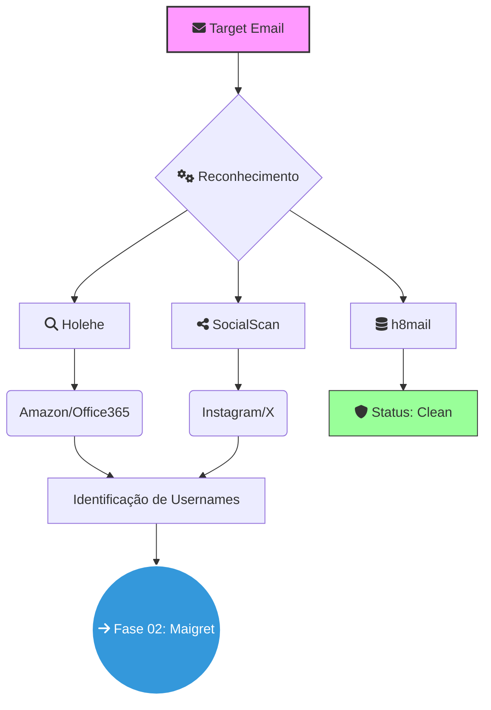
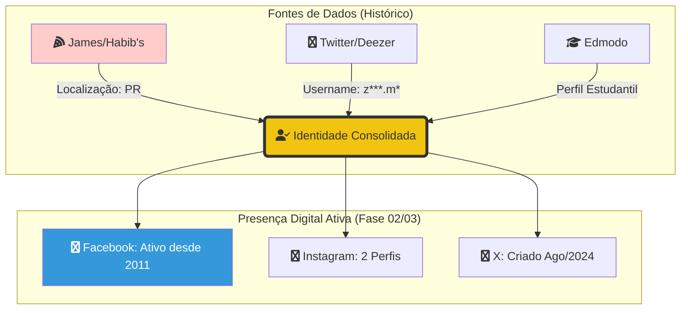

# 🕵️ Relatório OSINT: Enumeração de Pegada Digital
**Frameworks:** PTES (Fase 1) | NIST SP 800-115 | MITRE ATT&CK (Reconnaissance)
**Analista:** Zafire Daniel | **Data:** 2026  
**Alvo:** `e******d***@***.com` (Sanitizado)  
**Escopo:** Mapeamento de contas ativas e análise de superfície de exposição inicial.

---

## 📑 1. Enquadramento Metodológico (Compliance)

Nesta fase de coleta passiva e semi-passiva, aplicamos:

* **PTES (Intelligence Gathering):** Coleta de nível 1 focada em identificadores de e-mail.
* **MITRE ATT&CK (T1589.002):** Gather Victim Identity Information (Email Addresses).
* **NIST SP 800-115:** Execução de **Target Identification** e **Network Discovery** no nível de aplicação (SaaS).

---

## 🗺️ Fluxo de Dados e Pivoting (Mermaid)

## 🛠️ 2. Ferramentas Utilizadas & Metodologia NIST

| Ferramenta | Badge | Função Técnica | Objetivo NIST (SP 800-115) |
| :--- | :--- | :--- | :--- |
| **Holehe** |  | Verificação de registro via recovery | **Target ID** (SaaS Footprint) |
| **SocialScan** |  | Validação de e-mail e username | **Discovery Scanning** |
| **h8mail** |  | Busca em repositórios de vazamento | **Vulnerability Review** |

---

## ⚠️ 3. Análise de Riscos (Mapeamento MITRE ATT&CK)

Com base na enumeração realizada, foram mapeadas as seguintes superfícies de ataque:

1. **Exposição de E-Commerce (Amazon):** Técnica **T1591**. Facilita a execução de engenharia social baseada em falsas notificações de entrega ou faturamento.
2. **Uso de Office365:** Técnica **T1589**. Confirma a inserção do alvo em ecossistema corporativo/estudantil, elevando o risco de *Spear-Phishing*.
3. **Hobbyist/Dev Exposure (CodePen/Replit):** Técnica **T1593**. Identifica compartilhamento de código público, onde metadados ou segredos (API Keys) podem estar expostos.

---

## 🕵️‍♂️ 3.1 Análise de Atribuição e Correlação (Breach Enrichment)

> [!IMPORTANT] A Descoberta do "Fio da Meada"
> A análise de 10 fontes de vazamentos (2018-2023) permitiu a transição da investigação de um **E-mail anônimo** para uma **Identidade Real confirmada**.

### 🔗 Cadeia de Pivoting Encontrada:
1. **Ponto de Partida:** E-mail `e******d***@***.com`.
2. **Descoberta de Identidade (James/Habib's):** Vazamentos de delivery revelaram o nome real e coordenadas geográficas em **C******-PR**.
3. `e***d********` | **Dubsmash / Lazer** | **Handle Padrão:** Identificado como o identificador primário para serviços de entretenimento e gaming. |
4. `e******_g***` | **Twitter / X** | **Identidade Pública:** Utilizado para projeção em redes sociais abertas; alto potencial de coleta de opiniões e interações. |
5. `e******gd**` | **Edmodo / Educação** | **Pivô Acadêmico:** Vinculação direta com o ambiente estudantil e histórico de aprendizado técnico. |
6. `e****.d********_` | **Instagram** | **Vetor Social:** Perfil com maior densidade de metadados, fotos de terceiros e conexões familiares (Social Graph). |
7. `e***g*********` | **James Delivery** | **GEOINT:** Vinculação crítica com dados de consumo físico, permitindo a localização geográfica precisa. |

---
---
###📊 2. O Diagrama de "Rastro de Migração" (Mermaid)

---

## 📂 4. Acesso Rápido aos Artefatos (Cadeia de Custódia)

### 🛡️ Verificação de Integridade
| Arquivo | Descrição | SHA-256 Hash |
| :--- | :--- | :--- |
| `resultado_holehe.txt` | Log Bruto Holehe | `[COLE_O_HASH_AQUI]` |
| `resultado_h8mail.txt` | Log de Vazamentos | `[COLE_O_HASH_AQUI]` |

### 📄 Logs e Evidências
* 📜 [Log de Presença (Holehe)](../evidences/resultado_holehe.txt)
* 📜 [Log de Vazamentos (h8mail)](../evidences/resultado_h8mail.txt)
* 🖼️ [Captura de Tela - Resultados SocialScan](../evidences/screenshots/socialscan_results.png)

---

> [!TIP] Conclusão da Fase 01
> A enumeração de e-mail foi concluída com sucesso, permitindo o **Pivoting** para o Username Principal que será o objeto de estudo detalhado na **Fase 02 (Análise de Username)**.
