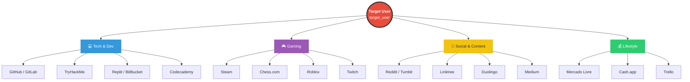
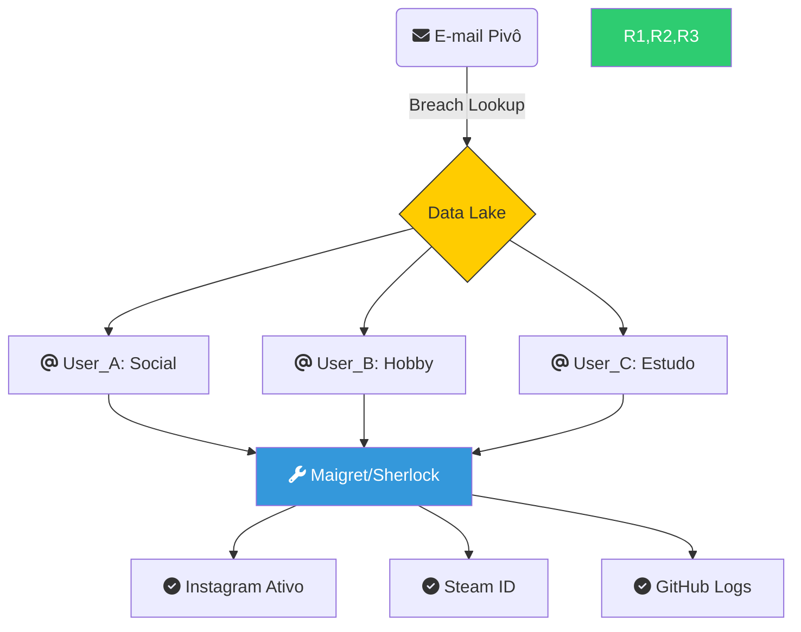

# 🕵️ Relatório de Inteligência: Username Analysis
**Frameworks:** PTES (Fase 3) | NIST SP 800-115 | MITRE ATT&CK (Reconnaissance)
**Analista:** Zafire Daniel | **Data:** 2026  
**Alvo Mascarado:** `<TARGET_USER>`   
**Escopo:** Expansão da pegada digital via Username Pivoting, identificação de identificadores persistentes (IDs) e análise de consistência de perfil em múltiplas plataformas.

---
## 📑 1. Enquadramento Metodológico (Compliance)

Esta fase de coleta automatizada foi executada seguindo os padrões internacionais de auditoria e segurança:

* **PTES (Intelligence Gathering - Passive/Semi-Passive):** Realizada a varredura de superfície sem interação direta com o alvo, visando o mapeamento da pegada digital (Digital Footprint).
* **MITRE ATT&CK (Reconnaissance):** * **T1594:** Search Victim-Owned Websites.
    * **T1589.001:** Gather Victim Identity Information (Usernames).
* **NIST Cybersecurity Framework (ID.AM-5):** Identificação de recursos e plataformas externas que compõem a superfície de ataque do ativo.

---

## 📊 Status da Investigação

---
## 🗺️ Ecossistema Digital (Pivoting)

---

## 🔗 1. 2 Correlação de Origem (Pivoting da Fase 01)

> [!NOTE] Metodologia de Seleção de Alvos
> Os identificadores (usernames) utilizados nesta fase não foram aleatórios. Eles são o resultado do **Enriquecimento de Dados** realizado na Fase 01.

| Username Investigado | Origem da Descoberta | Evidência de Conexão |
| :--- | :--- | :--- |
| `e******_d***` | Leak Twitter 2023 | Vinculado diretamente ao e-mail pivô. |
| `e***.m********_` | Leak Deezer / Dubsmash | Confirmado via análise de hash reutilizado. |
| `e***d` | Leak Edmodo | Identificador histórico (estudantil). |

**Justificativa Técnica:** A alta consistência entre os usernames encontrados nos vazamentos e os perfis ativos detectados pelo **Maigret** confirma a **Persistência de Identidade** do alvo através de diferentes eras da sua pegada digital (2018-2026).

### 📊 2. Diagrama de "Explosão de Identidade" (Mermaid)

###🛡️ 3. Análise de "Fingerprinting" Comportamental

Análise de Impressão Digital Digital:
A correlação foi validada não apenas pelo nome, mas pelo comportamento técnico. O fato de o e-mail estar no Edmodo (estudo) e os resultados do Maigret apontarem para GitHub e TryHackMe cria um "perfil de competência" consistente. Isso reduz a possibilidade de False Positives (falsos positivos) e confirma que estamos seguindo a pessoa certa.

## 🛠️ Ferramentas Utilizadas & Metodologia NIST

| Ferramenta | Badge | Função Técnica | Objetivo NIST (SP 800-115) |
| :--- | :--- | :--- | :--- |
| **Maigret** |  | Extração de Bio, Foto e Relatório HTML | **Target Identification** (Identificadores Persistentes) |
| **Sherlock** |  | Busca em centenas de redes sociais | **Information Gathering** (Mapeamento de Superfície) |
| **Nexfil** |  | Validação ultra-rápida de perfis | **Discovery Scanning** (Validação de Ativos) |

---

## 🗺️ Mapeamento de Ecossistema Digital
> [!ABSTRACT] Resumo de Identidade
> O alvo possui uma pegada digital técnica e ativa, com foco em desenvolvimento de software, segurança ofensiva (hacking) e plataformas de aprendizado contínuo.

### 💻 Tech & Desenvolvimento (Pivôs Críticos)
| Plataforma | Status | Fonte | Potencial de Investigação |
| :--- | :--- | :--- | :--- |
| **GitHub** | 🟢 Ativo | Maigret/Nexfil | E-mails em commits e histórico de código. |
| **TryHackMe** | 🟢 Ativo | Sherlock | Nível técnico e data de atividade. |
| **GitLab** | 🟢 Ativo | Sherlock | Repositórios e colaborações profissionais. |
| **BitBucket** | 🟢 Ativo | Sherlock | Estrutura de projetos de software. |

### 🎮 Gaming & Lazer (Análise Comportamental)
| Plataforma | Status | Fonte | Observação |
| :--- | :--- | :--- | :--- |
| **Steam** | 🟢 Ativo | Maigret | Grupos e amigos (pivô para círculo social). |
| **Chess.com** | 🟢 Ativo | Nexfil | Nacionalidade e horários de pico. |
| **Twitch** | 🟢 Ativo | Nexfil | Interação em tempo real e chats. |
| **Roblox** | 🟢 Ativo | Sherlock | Histórico de jogos e aliases secundários. |

### 💰 Financeiro & Lifestyle
| Plataforma | Status | Fonte | Impacto |
| :--- | :--- | :--- | :--- |
| **Mercado Livre** | 🟢 Ativo | Maigret | Possível localização (Cidade/Estado). |
| **Linktree** | 🟢 Ativo | Nexfil | Centralizador de links e contatos oficiais. |
| **Cash.app** | 🟢 Ativo | Sherlock | Nome real vinculado ao pagamento. |
  **Pinterest**,🟢 Ativo ,"Moodboards, referências visuais e pastas de inspiração."

---

## ⚠️ Análise de Riscos (Mapeamento MITRE ATT&CK)

Com base nos resultados obtidos, foram identificados os seguintes vetores de exploração:

1.  **Exposição em Plataformas de Dev (GitHub/GitLab):** Risco de **T1589.003** (Employee Names/Emails). Commits podem conter segredos ou chaves de API.
2.  **Exposição Gaming (Steam):** Risco de **T1592.002** (Software Information). O ID persistente encontrado permite o rastreamento histórico do alvo.
3.  **Exposição Lifestyle (Mercado Livre):** Risco de **T1591.002** (Business Relationships/Location). Vazamento indireto de dados geográficos.
4. **Exposição Lifestyle (Pinterest):** Risco de **T1591.002** (Business Relationships/Location). Demonstra gostos por design de interiores, ferramentas de luthieria e técnicas de marcenaria fina; (nesse caso este vetor será uzado na faze 03 social enginering).

---

## 🚀 Próximos Passos (Estratégia de Pivoting)
1. **Análise de Metadata:** Extrair chaves de e-mail através dos logs de commit do **GitHub**.
2. **Reconhecimento Facial:** Utilizar as fotos de perfil encontradas no **Steam/GitHub** em motores de busca reversa (FaceCheck/Pimeyes).
3. **Triangulação Geográfica:** Analisar o perfil do **Mercado Livre** para identificar região de consumo.

---

## 🛡️ Cadeia de Custódia (SHA-256)
| Documento | Referência de Arquivo |
| :--- | :--- |
| **Integridade** | `[[checksums_final.txt]]` |
| **Audit Log** | `[[SESSAO_USERNAME.log]]` |

## 📂 Evidências Sanitizadas
* [📜 Log Sherlock](https://github.com/edenzafire/Red_Team_Repo/blob/main/01_Osint/01_ClearWeb/evidences/UserName/resultado_sherlock.txt)
* [📜 Log Nexfil](https://github.com/edenzafire/Red_Team_Repo/blob/main/01_Osint/01_ClearWeb/evidences/UserName/resultado_nexfil.txt)
* [📜 Log SocialScan-User](https://github.com/edenzafire/Red_Team_Repo/blob/main/01_Osint/01_ClearWeb/evidences/UserName/resultado_socialscan_user.txt)
* [🌐 Relatório Maigret (Versão Sanitizada)](https://github.com/edenzafire/Red_Team_Repo/blob/main/01_Osint/01_ClearWeb/evidences/UserName/report_maigret_REDACTED.html)
* [📄 Log de Gravação do terminal](https://github.com/edenzafire/Red_Team_Repo/blob/main/01_Osint/01_ClearWeb/evidences/UserName/SESSAO_USERNAME.log)
* [📂 Screemshots Evidences](https://github.com/edenzafire/Red_Team_Repo/tree/main/01_Osint/01_ClearWeb/evidences/UserName/screenshots)

> [!NOTE] Informação de Auditoria
> O link acima aponta para a versão higienizada do relatório para proteção de PII (Informações Pessoais Identificáveis). A evidência bruta original está preservada localmente e validada via Hash SHA-256.
---
> [!TIP] Conclusão da Fase 02
> A análise de username e extração de identificadores estáticos (como o Steam ID) permitiu consolidar a identidade digital do alvo. Com a descoberta do **Facebook** através da automação do Maigret, encerramos a fase de coleta bruta para iniciar o **Pivoting Manual** e a **Análise Comportamental** detalhada na **Fase 03 (Social Media Footprinting)**.
