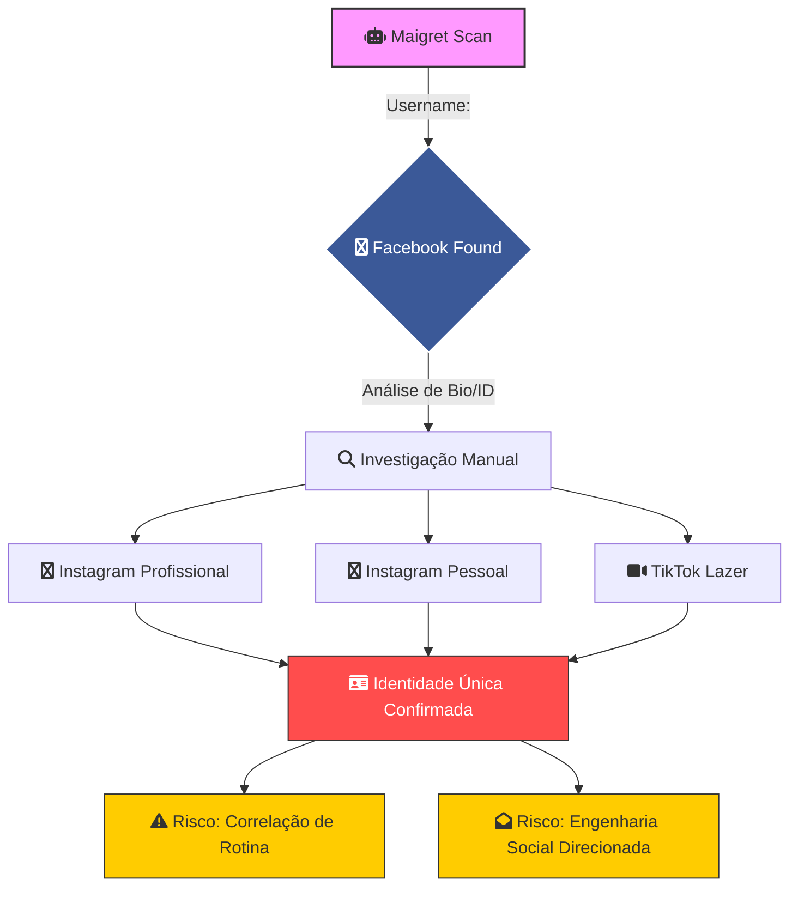

# 📱 Investigação OSINT: Social Media Footprinting & Behavioral Analysis
**Frameworks:** PTES (Fase 3) | NIST SP 800-115 | MITRE ATT&CK (Reconnaissance)
**Analista:** Zafire Daniel | **Data:** 2026  
**Alvo Mascarado:** `<TARGET_USER>`   
**Escopo:** Análise comportamental multiplataforma, triangulação de relacionamentos e avaliação de falhas de OPSEC (Segurança Operacional) através de correlação manual de dados..

---

## 📑 1. Alinhamento com Frameworks Internacionais

Nesta fase, aplicamos as seguintes metodologias para garantir a qualidade da análise:

* **PTES (Intelligence Gathering):** Coleta de dados de nível 2 (focada em mídias sociais).
* **NIST SP 800-115:** Atividade de *Review* e *Target Identification*.
* **MITRE ATT&CK:** Mapeamento da técnica **T1593** (Search Open Social Media Platforms) e **T1594** (Search Victim-Owned Websites).

---

## 🕵️ 2. Análise de Pivoting: Do Automático ao Manual

> [!CAUTION] Descoberta Crítica de Vetor
> O **Maigret** identificou com sucesso o **Facebook** do alvo. Através desta plataforma, foi realizada a técnica de **Pivoting Manual**, que permitiu a descoberta de camadas adicionais de exposição que a automação ignorou.

### 🔍 Cadeia de Descoberta (Chain of Custody)
1.  **Entrada:** Username `e***d****` -> **Ferramenta:** Maigret.
2.  **Pivô:** Perfil do Facebook (mesmo com username alterado).
3.  **Expansão Manual:** Através da análise de Bio/Amigos/Fotos no Facebook, foram identificadas:
    * **Instagram A:** Perfil Profissional (Username: `[OCULTADO]`)
    * **Instagram B:** Perfil Pessoal (Username: `[OCULTADO]`)
    * **TikTok:** Perfil de Lazer (Username: `[OCULTADO]`)

## 🔗 2.1 Correlação de Inteligência (Breach to Social Media)

> [!TIP] Validação por Dados Históricos
> A transição para a análise manual foi validada por dados recuperados no **Módulo 06 (Breach Analysis)**. Os vazamentos atuaram como a "Chave de Identidade" para confirmar os perfis.

### 🧩 Tabela de Cruzamento de Dados (Link Analysis)

| Dado da Breach (Fase 06) | Plataforma Social (Fase 03) | Valor da Correlação |
| :--- | :--- | :--- |
| **Username `e******_d***`** | **Twitter / X** | Confirmou a autoria da conta criada em Ago/2024 via handle persistente. |
| **Nome Real (Deezer/Habib's)** | **Facebook** | Permitiu localizar o perfil ativo desde 2011, mesmo com privacidade restrita. |
| **Localização (James/Habib's)** | **Instagram / FB** | Validou a transição geográfica do alvo de **P*** A****** para **C*******-PR**. |
| **E-mail `e******d***@***.com`** | **TikTok / Instagram** | Utilizado para validar a função "Esqueci minha senha" (sem concluir), confirmando vínculo. |

---

### 🕵️ Análise de Falha de OPSEC: "Digital Echo"
A investigação identificou o fenômeno de **"Eco Digital"**: o alvo alterou seus usernames recentemente para tentar ganhar privacidade, porém, os dados de **Breaches de 2018-2023** serviram como um índice histórico. 

* **Impacto:** Mesmo que o alvo mude o nome hoje, o **ID numérico interno** (recuperado via Twitter Leak) e o **Nome Real** (recuperado via Deezer) permitem que o analista localize as novas contas em segundos. Isso demonstra a técnica **T1589.001** (Gather Victim Identity Information) em sua forma mais pura.

---
### 📊 Fluxograma de Propagação de Identidade (Mermaid)

---

## 📊 3. Matriz de Exposição Comportamental (MITRE PRE-ATT&CK)

| Técnica MITRE | Descrição da Exposição | Gravidade |
| :--- | :--- | :--- |
| **T1589.001** | Coleta de nomes reais via Bio do Facebook. | 🔴 Alta |
| **T1593.001** | Uso de múltiplas redes (Instagram/TikTok) para cruzamento de rotina. | 🟡 Média |
| **T1590.002** | Identificação de círculo social e relacionamentos. | 🟡 Média |

---

## 🖼️ 3.1 Análise de Correlação (Cross-Platform)

Mesmo com usernames distintos, a correlação de identidade foi confirmada por:
* **Identidade Visual:** Uso do mesmo padrão de fotos ou cenários (IMINT).
* **Links Cruzados:** Menções cruzadas em "Linktree" ou Bios que não foram higienizadas.

---

## 🗺️ 4. Vetores de Localização (Footprinting Social)

> [!TIP] Indícios de Presença Física
> Durante a análise das redes sociais, foram identificados artefatos que vinculam a persona digital a uma localização física específica, servindo de base para o Módulo 05 (GEOINT).

### 🔍 3.1 Evidências de Geolocalização Passiva
* **Check-ins e Marcas:** Postagens no Facebook e fotos no Instagram sugerem rotinas na região metropolitana de **Curitiba/Araucária - PR**.
* **Migração Identificada:** Cruzamento de dados históricos aponta uma transição de residência (P**** A***** -> Curitiba -> Araucária).
* **Metadados de Perfil:** Identificada a presença de artefatos EXIF em fotos de perfil específicas (X/Twitter), permitindo o pivoting para análise de alta precisão.

---

### ⚠️ 4.1 Alinhamento de Riscos (Social Context)
A exposição de rotinas de lazer e consumo em perfis públicos permite a criação de um cronograma de atividades do alvo, facilitando abordagens de engenharia social baseadas em contexto geográfico.

> [!IMPORTANT] Transição de Módulo
> As coordenadas exatas, análise de infraestrutura de rede (IP/ASN) e a triangulação via satélite serão detalhadas no **Módulo 05: GEOINT & Physical Recon**.

### 🔗 4.2 Correlação de Dados Legados (Breach Enrichment)

> [!NOTE] Validação de Origem
> Os indícios geográficos detectados nesta fase possuem correlação direta com os ativos recuperados no **Módulo 06 (Breaches Analysis)**, especificamente nos logs de serviços de delivery (2019).

* **Consistência de Dados:** A localização sugerida nas redes sociais coincide com o raio de ação das coordenadas recuperadas via James Delivery/Habib's.
* **Transição de Fase:** Esta descoberta foi catalogada como um "Pivô de Alta Confiança".
* **Próximos Passos:** Uma análise técnica de precisão métrica (IMINT/EXIF) e a triangulação definitiva dos pontos de acesso (IP/ASN) serão realizadas detalhadamente no **Módulo 04: GEOINT & Physical Recon**.

## 🛡️ 5. Plano de Remediação (Hardening Baseado no NIST)

Seguindo as funções **IDENTIFY** e **PROTECT** do NIST Cybersecurity Framework:

> [!IMPORTANT] Análise de Vulnerabilidade Humana
> A falha não reside na ferramenta, mas no comportamento: a reutilização de informações em diferentes plataformas anula a troca de username.

### Checkbox de Hardening:
- [ ] **PR.AT-1 (NIST):** Treinamento de conscientização sobre "Oversharing".
- [ ] **Remediação T1593:** Configurar o TikTok e Instagram para modo "Privado" e remover sugestão de conta por número de telefone.
- [ ] **Sanitização de Metadados:** Limpar o histórico de nomes anteriores no Facebook para evitar detecção via ID persistente.

> [!TIP] Conclusão da Fase 03
> A análise das midias sociais e extração de identificadores estáticos (como o Steam ID) permitiu consolidar a identidade digital do alvo e uma posivel geolocalizacao. Atraves de fotos e vinculos sociais, encerramos a fase de coleta bruta para iniciar o **Phone Analysis** e a **Rastro digital** detalhada na **Fase 04 (Phone Analysis)**.
