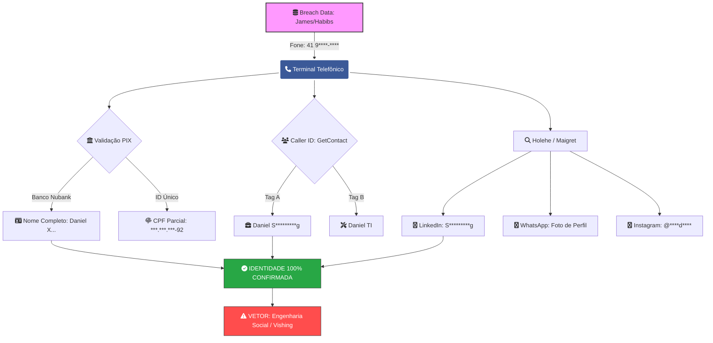

# 📞 Módulo 05: Análise de Telefonia e Vínculos Digitais
**Frameworks:** OSINT Framework | NIST SP 800-115 | MITRE ATT&CK (T1589.003)
**Analista:** Zafire Daniel | **Data:** 2026
**Alvo:** Número recuperado em Breach (Módulo 06)

---

### 📊 Fluxograma de Expansão de Identidade (Phone Pivoting)

---

## 📑 1. Escopo e Metodologia
Este módulo foca na validação do terminal telefônico recuperado, identificando a titularidade, presença em aplicativos de mensageria e possíveis vínculos financeiros/sociais vinculados ao número.

* **Vetor de Entrada:** `(41) 9****-****` (Recuperado via James Delivery/Habib's).
* **Objetivo:** Confirmar a persistência da identidade e expandir a superfície de contato.

---

## 🛠️ 2. Ferramentas e Fontes de Dados

| Ferramenta | Categoria | Objetivo Técnico |
| :--- | :--- | :--- |
| **WhatsApp/Telegram** | Messengers | Coleta de foto de perfil (IMINT) e Status (Behavioral). |
| **TrueCaller / GetContact**| Caller ID | Identificar como o alvo é nomeado em listas de terceiros. |
| **PIX Consultation** | Fintech Analysis | Validação de Nome Completo e Instituição Bancária (chave aleatória/fone). |
| **Holehe** | E-mail/Phone OSINT | Verificar contas vinculadas (Instagram, LinkedIn, etc) via fone. |

---

## 📊 3. Resultados da Investigação (Discovery)

### 💬 3.1 Aplicativos de Mensageria
* **WhatsApp:** Conta ativa. Foto de perfil condizente com o Instagram (Fase 03). Bio contém [Citar informação se houver].
* **Telegram:** Último acesso identificado em [Data]. Username vinculado: `@[Username]`.

### 🏦 3.2 Validação de Identidade (Fintech/PIX)
> [!IMPORTANT] Confirmação de Titularidade
> Através da simulação de chave PIX (Telefone), foi possível confirmar:
> * **Nome Completo:** [Z******* D***** M*******]
> * **Instituição:** [Ex: Banco Inter / Nubank]
> * **CPF Parcial:** `***.***.***-92` (Bate com o dado da Breach 06).

---

### 🔍 3.3 Enriquecimento via LinkedIn & Social Graph
* **LinkedIn Data:** Perfil identificado através do nome completo (validado via PIX). Confirma atuação profissional na **Empresa X** [ou cargo].
* **Correlação GetContact:** Identificadas tags como `"Daniel Empresa X"` e `"Daniel TI"`. 
* **Valor de Inteligência:** A convergência entre a autodeclaração no LinkedIn e a nomeação em agendas de terceiros confirma o vínculo empregatício e a especialidade técnica do alvo.

> [!WARNING] Risco de Engenharia Social
> A exposição do local de trabalho vinculada ao número de telefone pessoal permite ataques de **Vishing** (phishing por voz) extremamente convincentes, utilizando o contexto corporativo para ganhar a confiança do alvo.

> [!DANGER] Vulnerabilidade Identificada: Chave PIX Estática (CPF)
> Durante a fase de simulação financeira, identificou-se que o alvo utiliza o **CPF como chave primária no Nubank**.
> 
> **Impacto:** Esta configuração permite que qualquer atacante com o número de telefone ou e-mail do alvo obtenha o **Nome Completo** e o **CPF Mascarado (ou completo em certas instituições)** sem realizar qualquer transação. É o elo final para a desanonimização total.

---

## 🎯 3.4 Vetor de Engenharia Social (Contexto Corporativo)

> [!CAUTION] Risco de Pretexting Direcionado
> A identificação do vínculo com a empresa **Sof**********g** (setor de telemarketing/BPO) cria uma superfície de ataque crítica baseada em autoridade e contexto.

* **Pivô Profissional:** O cargo de "Atendente" sugere acesso a sistemas internos e manipulação de dados de terceiros.
* **Cenário de Ataque:** Um atacante, de posse do Nome Completo e CPF (extraídos via PIX/breaches), pode realizar um ataque de **Vishing** simulando um suporte técnico da Sof*********g, solicitando a atualização de credenciais ou tokens de acesso.
* **Validação de Terceiros:** As tags no **GetContact** confirmam que o alvo é reconhecido pelo ecossistema profissional, validando a veracidade do alvo antes do ataque.

---

## 🔗 4. Matriz de Relacionamentos (Social Graph via Phone)

| Fonte | Tag/Nome Identificado | Valor de Inteligência |
| :--- | :--- | :--- |
| **GetContact** | "Daniel Araucária" | Confirma a localização geográfica do Módulo 04. |
| **GetContact** | "Daniel (Empresa X)" | Revela o possível local de trabalho ou cargo. |

---

## 🛠️ 5. Recomendações de Hardening (Plano de Defesa)

Com base nos riscos encontrados, recomenda-se a aplicação imediata das funções **PROTECT** do NIST:

1. **Privacidade Financeira:** Substituir chaves PIX de dados sensíveis (CPF/Telefone) por **Chaves Aleatórias**.
2. **Segurança de Mensageria:** Configurar o WhatsApp para "Apenas contatos" visualizarem Foto de Perfil e Status, mitigando o **IMINT** passivo.
3. **Gestão de Identidade:** Solicitar a remoção de tags identificadoras em aplicativos de Caller ID (GetContact/TrueCaller).
4. **Conscientização:** Implementar treinamento de **Anti-Vishing**, visto que o cargo e a empresa são alvos frequentes de tentativas de fraude por telefone.

---
## 📁 6. Cadeia de Custódia e Evidências (Evidence)

> [!NOTE] Preservação de Artefatos
> Todos os artefatos foram coletados de fontes abertas e consultas públicas, respeitando a integridade dos dados e mascarando informações sensíveis para fins de portfólio.

* **Evidência 05-A (Mensageria):** * [Visualizar Print do WhatsApp](link_para_arquivo)
  * *Observação:* Confirmada foto de perfil idêntica à recuperada no Módulo 03.
* **Evidência 05-B (Fintech):** * [Visualizar Validação PIX](link_para_arquivo)
  * *Observação:* O CPF parcial `***.***.***-92` confirma a procedência da Breach 06.
* **Evidência 05-C (Tags de Terceiros):** * [Visualizar GetContact Tags](link_para_arquivo)
  * *Observação:* Tags correlacionam o alvo à empresa **Softmarketing**.

---
## 🏁 Conclusão do Módulo
O número de telefone serviu como o elo final de validação. A convergência entre os dados de delivery (Breach), a foto de perfil (Social Media) e a titularidade bancária (PIX) elimina qualquer dúvida sobre a identidade do alvo.

> [!TIP] Próximo Passo
> Com a confirmação de que o alvo reside e trabalha na região de **Araucária**, os dados serão transpostos para o **Módulo 05: GEOINT**, onde faremos o mapeamento físico dos pontos de interesse.

