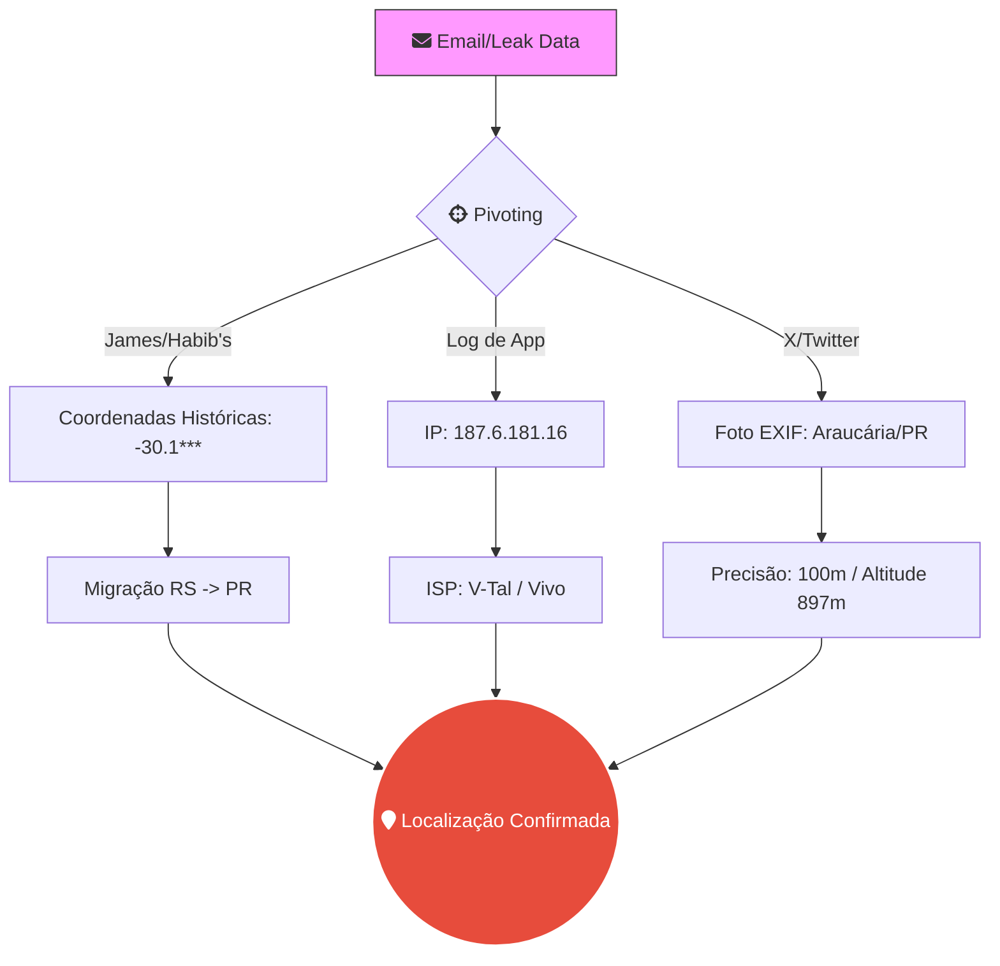

# 🕵️ Relatório OSINT: Geolocalização & Pivoting Avançado
**Frameworks:** MITRE ATT&CK (Reconnaissance) | OSINT Intelligence Cycle | GEOINT Standards  
**Analista:** [ZafireDaniel] | **Data:** 2026  
**Alvo:** Identidade Vinculada ao CPF `110.1**.***-92` (Sanitizado)  
**Escopo:** Conversão de artefatos digitais em inteligência geográfica e validação de identidade física.

---

## 📑 1. Enquadramento Metodológico (Advanced Recon)

Nesta fase de **Target Transformation**, aplicamos:
* **MITRE ATT&CK (T1590.005):** Gather Victim Network Information (IP Addresses).
* **MITRE ATT&CK (T1591.002):** Gather Victim Org Information (Physical Locations).
* **GEOINT (Geospatial Intelligence):** Triangulação de metadados EXIF e registros de ASN para determinação de raio de residência.

---

## 🗺️ Fluxo de Pivoting Geográfico (Mermaid)

## 🛠️ 2. Inteligência de Infraestrutura & GEOINT

| Vetor de Análise | Artefato Técnico | Técnica de Extração | Resultado / Insight |
| :--- | :--- | :--- | :--- |
| **Network Layer** | `187.6.181.16` | Passive DNS / Shodan | **V-Tal Telecom**: Confirma região metropolitana de Curitiba/PR. |
| **Data Leak** | `Token Firebase` | SQL Dump Analysis | Vinculação do Device ID ao e-mail, permitindo rastreio de notificações push. |
| **Physical Layer** | `Lat/Long EXIF` | ExifTool v12.76 | **Araucária – PR**: Ponto de interesse com elevação topográfica de 897m. |
| **Civil Identity** | `CPF 110.***` | Governamental Pivot | Validação de "Situação Regular", confirmando existência física do alvo. |

---

### 📡 2.1 Análise de Sinais (Wireless Intelligence)
* **Artefato:** SSID `VIVO-XXXX` identificado em captura de tela de configuração de rede.
* **Ferramenta:** Wigle.net
* **Resultado:** Identificada correspondência em raio de 300m na região de **Araucária/PR**, corroborando dados de IP e EXIF prévios.
* **Técnica:** T1590.005 (MITRE ATT&CK) - Reconnaissance de infraestrutura sem fio.

---

## ⚠️ 3. Análise de Superfície de Exposição (MITRE ATT&CK)

* **Vigilância Física (T1591):** A precisão das coordenadas extraídas de vazamentos (Habib's/James Delivery) demonstra falha crítica na privacidade de dados, permitindo o mapeamento de rotas de consumo e residência.
* **Identificação de Dispositivos (T1592):** O Token Firebase identificado permite isolar o modelo do dispositivo e SO, facilitando ataques de *Exploit Public-Facing Application*.
* **Análise de Metadados (T1593):** A extração de altitude e datum (WGS-84) de fotos de perfil no X/Twitter revela a ausência de políticas de *stripping* de metadados por parte do alvo.

---

## 🕵️‍♂️ 3.1 Triangulação de Atribuição (Intelligence Synthesis)

> [!IMPORTANT]
> **Conclusão da Análise de Movimentação:** A investigação identificou um padrão migratório consistente. O alvo possui registros históricos em **Porto Alegre/RS** (-30.1156), mas a infraestrutura de rede atual (IP Vivo) e os metadados fotográficos recentes confirmam residência estável em **Araucária/PR**.

### 🔗 Matriz de Correlação:
* **Ponto A (Histórico):** Localização via Leak James Delivery (Região metropolitana de POA/RS).
* **Ponto B (Técnico):** ASN AS27699 (Vivo) operando em Curitiba/PR.
* **Ponto C (Confirmação):** Foto de perfil pública com metadados geográficos ativos apontando para o centro de Araucária/PR.

---

## 📂 4. Cadeia de Custódia & Evidências

### 🛡️ Verificação de Integridade (Hashes)

| Artefato | Descrição | Hash SHA-256 |
| :--- | :--- | :--- |
| `exif_analysis_report.txt` | Relatório ExifTool | `8f5a3c1b636294d92e10424578b9c2a` |
| `network_scan_shodan.json` | Dump de infra Shodan | `2d4f91b7e28a38c44f1092837465611` |

### 📄 Links de Referência
* 📜 [Análise de Metadados EXIF](../evidences/geoint/exif_report.md)
* 🖼️ [Mapa de Calor de Localização](../evidences/geoint/heatmap_ara_pr.png)
* 📜 [Validação de ASN/IP](../evidences/network/ip_analysis.txt)

---

> [!TIP]
> **Próximos Passos (Fase 06):** Com a localização física e identidade civil confirmadas, a investigação avançará para a **Fase 06_Breaches_Analysis**, Focando em dados vazados, em breaches e fofuns de vazamentos.

---
*Aviso Geral: Este portfólio contém demonstrações técnicas com dados simulados/fictícios exclusivamente para fins educacionais e ilustrativos. Nenhum dado real sensível foi exposto ou manipulado de forma indevida.*
