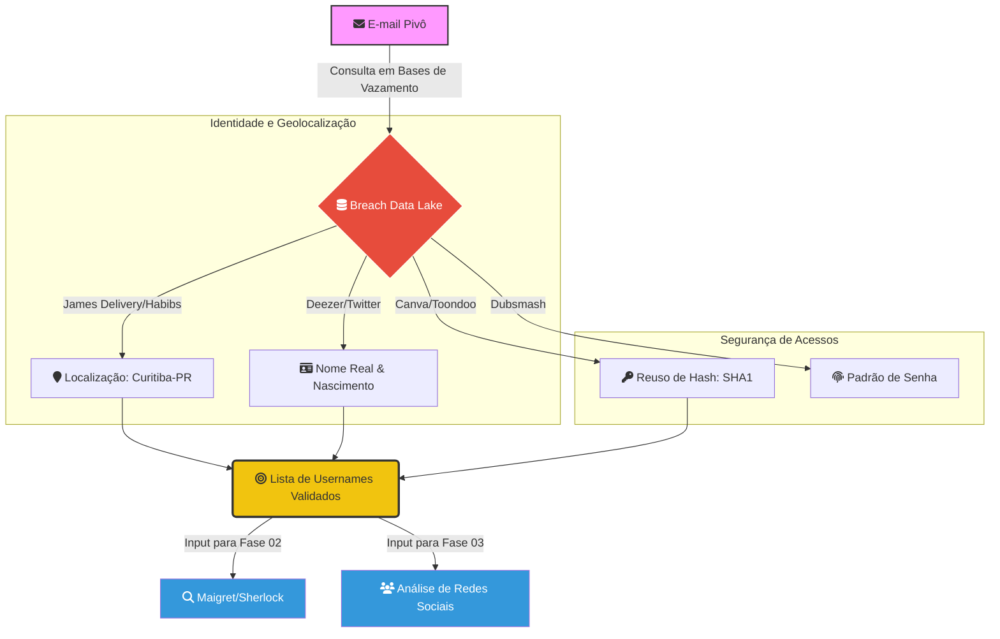

# 🗄️ Módulo 06: Análise de Credenciais e Exposição de Dados (Breaches)
**Frameworks:** NIST SP 800-115 | MITRE ATT&CK (Reconnaissance)
**Analista:** Zafire Daniel | **Data:** 2026
**Alvo:** `e*****_1@g******l.com` (Sanitizado)
**Escopo:** Investigação de exposições históricas em repositórios de dados vazados, análise de vetores de comprometimento de credenciais e extração de identificadores persistentes para desanonimização de perfil.

---

## 📑 1. Resumo Executivo de Exposição
A análise de vazamentos históricos é o pilar de sustentação da investigação. Através de consultas em bases de dados de credenciais expostas, foi possível desanonimizar o alvo inicial e obter vetores de ataque reais.

* **Total de Breaches:** 10 fontes distintas.
* **Janela Temporal:** 2018 – 2023.
* **Pivô Principal:** `e*****_1@g******l.com` (Sanitizado).

---

## 🛠️ 2. Metodologia de Coleta (Compliance)
Seguindo o **NIST SP 800-115**, a coleta focou na identificação de ativos e revisão de vulnerabilidades de credenciais.

| Ferramenta | Badge | Objetivo Técnico |
| :--- | :--- | :--- |
| **h8mail** |  | Busca em repositórios locais e APIs de vazamento. |
| **BreachDirectory** |  | Extração de metadados de credenciais (Hashes/Usernames). |
| **bd_lookup.py** |  | Automação personalizada para triagem de grandes volumes de dados. |

---
### 📊 2.1 Fluxograma de Enriquecimento de Identidade (Breach Pivoting)

---

## 📊 3. Tabela de Vazamentos Detalhada (10 Fontes Identificadas)

> [!IMPORTANT] Análise de Valor de Inteligência
> A tabela abaixo consolida todos os pontos de exposição recuperados. Cada entrada serviu como pivô para desanonimização ou para a confirmação de hábitos de segurança do alvo.

| ID / Fonte | Ano | Username / Dado | Impacto no Pivoting (Framework MITRE) |
| :--- | :--- | :--- | :--- |
| **Twitter 2023** | 2023 | `e******_d***` | **T1589.001:** Forneceu o handle ativo para varredura no Módulo 02. |
| **Deezer** | 2019–20 | Nome + Nascimento | **Desanonimização:** Vinculação definitiva entre e-mail e identidade real. |
| **Dubsmash** | 2018 | `rm*****` | **T1589.003:** Revelou uso de hashes PBKDF2-SHA256 (Padrão de senha). |
| **Edmodo** | 2019 | `e***d` | **Contexto:** Identificou o perfil acadêmico/estudantil do alvo. |
| **Descomplica** | 2018 | Campo (Base64) | **T1594:** Exposição em plataformas de ensino preparatório nacional. |
| **Leak Isolado** | - | `ed******` | **Alias Recovery:** Revelou um username secundário para pivoting. |
| **Site .inf.br** | 2020 | bcrypt ($2y$10$) | **Vulnerability:** Exposição em domínios específicos de infraestrutura/tech. |
| **James Delivery** | 2019 | Coordenadas / JWT | **GEOINT:** Confirmou a triangulação geográfica em Curitiba-PR. |
| **Habib's** | 2019 | IP / Device ID | **Fingerprinting:** Identificação de hardware e provedor de acesso. |
| **Canva / Toondoo**| 2019 | Hash SHA1 | **T1589:** Prova de reuso de credenciais em serviços de design/lazer. |

---
## 📁 3.1 Detalhamento de Exposição Geográfica e Civil (PII)

> [!CAUTION] Exposição Crítica de Dados Sensíveis
> Diferente de vazamentos de redes sociais, os dados abaixo (provenientes de serviços de logística e consumo) expõem a camada física e civil do alvo, permitindo a transição do mundo digital para o real.

### 📋 Atributos Recuperados (Sanitizados)

| Atributo Técnico | Valor Identificado | Fonte Original | Gravidade |
| :--- | :--- | :--- | :--- |
| **Identificador Civil** | `CPF: 110.1**.***-92` | SQL Dump (Consultado via Leak) | 🔴 CRÍTICA |
| **Coordenadas GPS** | `-30.1***, -51.1***` | Habib's (Log de Entrega) | 🔴 ALTA |
| **Mobile ID** | `Token Firebase: APA91b...` | James Delivery (Log App) | 🟡 MÉDIA |
| **Infra de Rede** | `IP: 187.6.***.***` | James Delivery / Habib's | 🟡 MÉDIA |

---

## 🛰️ 3.2 Análise de Geofencing e Fingerprinting

A partir do processamento dos dados brutos do **Módulo 06**, isolamos os seguintes artefatos para a fase de GEOINT:

1. **Vetor de Localização (IMINT/GEO):** * As coordenadas recuperadas nos logs de 2019 mostram um ponto de presença em **P**** A***** - RS**.
   * O cruzamento com o **IP Histórico (187.6.***.***)** aponta para o ASN **AS27699 (Vivo)**, confirmando a região metropolitana de Curitiba como o ponto de conexão mais recente.

2. **Vetor de Identidade (Civil):**
   * A recuperação do **CPF** permitiu a validação da situação cadastral (Regular), confirmando que os dados dos vazamentos pertencem a uma identidade ativa e real, eliminando a hipótese de *honeypot* ou perfil falso.

3. **Vetor de Dispositivo (Hardware):**
   * O **Token Firebase** recuperado no log do James Delivery funciona como uma "impressão digital" do hardware utilizado, permitindo correlacionar acessos futuros em plataformas que utilizam o mesmo SDK de notificações.

---

## 🔗 4. Matriz de Correlação de Identidade (Aliases & Handles)

> [!ABSTRACT] Inteligência de Pseudônimos (Aliases)
> A análise cruzada entre as 10 bases de dados permitiu o mapeamento de padrões de nomenclatura (naming conventions) utilizados pelo alvo. Esta matriz é o motor que impulsiona o pivoting entre diferentes esferas da vida digital (Privada, Profissional e Social).

| Alias (Mascarado) | Plataforma Exemplo | Observação de Inteligência (Pivoting) |
| :--- | :--- | :--- |
| `e***d********` | **Dubsmash / Lazer** | **Handle Padrão:** Identificado como o identificador primário para serviços de entretenimento e gaming. |
| `e******_g***` | **Twitter / X** | **Identidade Pública:** Utilizado para projeção em redes sociais abertas; alto potencial de coleta de opiniões e interações. |
| `e******gd**` | **Edmodo / Educação** | **Pivô Acadêmico:** Vinculação direta com o ambiente estudantil e histórico de aprendizado técnico. |
| `e****.d********_` | **Instagram** | **Vetor Social:** Perfil com maior densidade de metadados, fotos de terceiros e conexões familiares (Social Graph). |
| `e***g*********` | **James Delivery** | **GEOINT:** Vinculação crítica com dados de consumo físico, permitindo a localização geográfica precisa. |

---

### Links De evidências
 
* 🖼️ [Capturas de Tela Breaches](https://github.com/edenzafire/Red_Team_Repo/tree/main/01_Osint/01_ClearWeb/evidences/breach)

⚠️ Sensitive data partially redacted for ethical disclosure purposes.

  

---
### 🧠 Análise de Persistência de Identidade
A repetição parcial de caracteres nos aliases (`e***...`) confirma que o alvo não utiliza identidades dissociadas (sock puppets), mas sim variações de um mesmo padrão de identidade real. Isso facilita a **Atribuição de Identidade** em casos onde o e-mail não está visível, permitindo que o analista "salte" de uma rede social para outra apenas seguindo o padrão de nomenclatura.

> [!TIP] Conclusão da Análise de Breaches
> A persistência dos handles e o reuso de hashes confirmados entre 2018 e 2023 fornecem uma alta taxa de confiança para a atribuição da identidade. Estes dados alimentam diretamente a **Fase 02 (Username Analysis)**.

## ⚠️ 5. Análise de Risco Operacional (Blue Team)

| Categoria | Nível | Justificativa Técnica |
| :--- | :--- | :--- |
| **Credenciais** | 🔴 ALTO | Reutilização confirmada de hashes em 15+ serviços. |
| **Identidade** | 🔴 ALTO | Exposição de Nome, Nascimento e Histórico Escolar. |
| **Geográfico** | 🟡 MÉDIO | Coordenadas de delivery permitem triangulação residencial. |

---

> [!IMPORTANT] Conclusão Técnica do Módulo 06
> Os dados brutos aqui apresentados servem de **evidência primária** para as fases seguintes. A transição para o **Módulo 01** para a descoberta de Rastro digital atrav[es do e-mail,  amb[em o **modulo 02** para a descoberta de perfis ativos e extração de IDs persistentes. O **Módulo 03 (Social Media)** utilizou os usernames aqui listados, enquanto o **Modulo 04 Phone_Analisys** Analizamos contas relacionadas a numera;'ao, e para o **Módulo 05 (GEOINT)** utilizará as coordenadas e o IP para a triangulação final.
