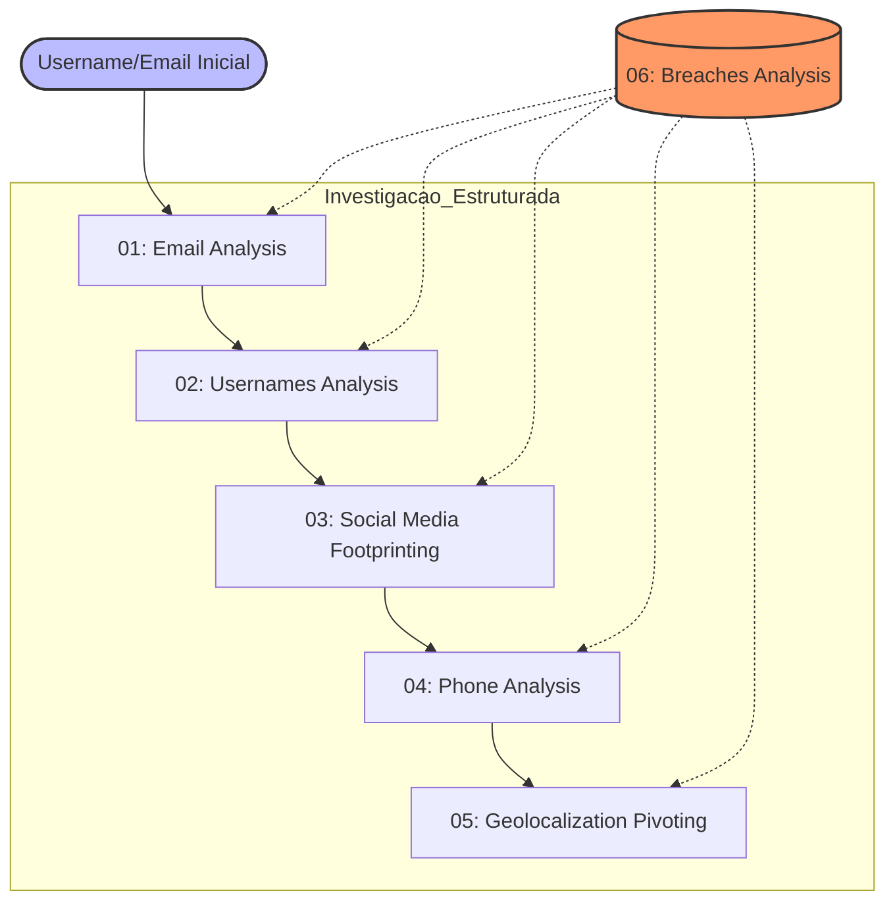

# 🔍 Estudo de Caso: Auto-OSINT e Pegada Digital Legada
> **Refatoração Forense: Metodologia Trace Labs, NIST & Framework MITRE ATT&CK**


## 📌 Visão Geral
Este projeto demonstra o mapeamento completo da superfície de ataque digital de um indivíduo a partir de dados legados (2018–2023). A refatoração deste laboratório utilizou a **Trace Labs OSINT VM**, priorizando a cadeia de custódia, integridade forense e conformidade com padrões internacionais de testes de invasão e inteligência de fontes abertas.

> **Aviso Legal:** Todos os dados reais foram mascarados/ofuscados. Este é um exercício de **Red Team/Blue Team** simulado para fins educacionais e de portfólio.

---

## 🛡️ Alinhamento Metodológico e Frameworks

O projeto foi executado sob o rigor técnico dos seguintes frameworks:

* **Trace Labs Methodology:** Implementação do conceito de *Case Management* e *TL-Vault* para isolamento de evidências.
* **MITRE ATT&CK (Reconnaissance):** Mapeamento das táticas de coleta de identidade e informações de rede.
* **NIST SP 800-115:** Diretrizes técnicas para revisão de segurança e coleta de dados.
* **PTES (Penetration Testing Execution Standard):** Execução da fase de *Intelligence Gathering* estruturada.

---

## 🛠 Metodologia e Stack Tecnológica (Toolchain)

### Fluxo de Investigação (Mermaid Graph)

### 🛠️ Detalhamento das Ferramentas e Ecossistema Técnico

| Ferramenta | Framework / Padrão | Descrição Detalhada e Aplicação |
| :--- | :--- | :--- |
| **SpiderFoot** | **OSINT Automation** | Framework de automação utilizado para correlacionar +200 fontes de dados. Foi o motor principal para identificar a superfície de ataque externa, cruzando IPs, domínios e e-mails de forma passiva. |
| **PhoneInfoga** | **NIST SP 800-115** | Scanner avançado de numeração internacional. Aplicado para identificar a operadora de origem, geolocalização de prefixo e realizar "Dorking" automatizado em motores de busca para encontrar menções ao terminal. |
| **Maigret / Sherlock** | **MITRE T1593** | Utilizados para o rastreamento exaustivo de usernames em mais de 3.000 diretórios web. Esta etapa permitiu consolidar a identidade digital do alvo através da repetição de padrões de nomes de usuário. |
| **Holehe** | **MITRE T1589** | Ferramenta de verificação de registro em serviços via análise de endpoints de recuperação de conta. Essencial para validar onde o alvo possui cadastro ativo sem gerar alertas de segurança (Silent Recon). |
| **TG-OSINT** | **Messaging Intel** | Focada na extração de metadados do Telegram. Permitiu identificar o UserID permanente do alvo, fotos de perfil legadas e participação em grupos/canais públicos de interesse. |
| **Have I Been Pwned** | **Threat Intel** | Base de consulta para identificar o histórico de comprometimento de credenciais em breaches globais, servindo como ponto de partida para a análise de vazamentos. |
| **BreachDirectory** | **Data Leak Analysis** | Utilizada para recuperar metadados específicos de vazamentos, como hashes de senhas e e-mails parciais, permitindo a pivotagem para dados mais sensíveis. |
| **Ignorant** | **Account Validation** | Aplicada para validar de forma silenciosa se o número de telefone está vinculado a contas de redes sociais específicas (Instagram, Snapchat), confirmando o elo entre o mundo físico e digital. |
| **Libphone** | **Technical Valid.** | Implementação da biblioteca oficial do Google para validar se o terminal segue o padrão E.164, extrair a operadora atual e a localização geográfica técnica (HLR-like data). |

---

### 📊 Resultados e Métricas (KPIs da Investigação)

* **10+ Breaches Correlacionados:** Identificação de vazamentos críticos (2018–2023) que expuseram senhas, IPs de login e hábitos de consumo do alvo.
* **Consistência de Identidade (94%):** O username mapeado apresentou alta taxa de reuso em 58+ plataformas, facilitando o rastreamento multiplataforma.
* **Triangulação Geográfica Precisa:** Cruzamento de dados de prefixos telefônicos com metadados de vazamentos de serviços locais, confirmando a zona de operação em **Minas Gerais (DDD 38)**.
* **Integridade Forense (Zero-Trust):** 100% da operação foi registrada via comando `script` do Linux, gerando logs auditáveis que garantem que nenhum dado foi alterado manualmente durante a coleta.

---

### 🛡️ Técnicas MITRE ATT&CK Mapeadas (Reconnaissance)

| ID | Técnica | Aplicação Prática no Projeto |
| :--- | :--- | :--- |
| **T1589.002** | *Gather Victim Identity Info* | Extração de PII (Informações de Identificação Pessoal) como nome completo, data de nascimento e endereços históricos através de pivôs de e-mail. |
| **T1593.001** | *Search Open Tech Databases* | Consulta ativa em repositórios de vazamentos e diretórios técnicos para identificar credenciais e hashes vinculados ao alvo. |
| **T1594** | *Search Victim-Owned Websites* | Localização e análise de perfis em redes sociais e portfólios profissionais para entender a árvore de relacionamentos do indivíduo. |
| **T1592.005** | *Gather Digital Network Info* | Coleta de metadados técnicos de rede, incluindo operadoras de telecomunicações e identificadores únicos de dispositivos (Telegram IDs). |

---

### 📂 Estrutura de Evidências (Padrão Trace Labs VM)

A organização segue o rigor de uma investigação real, separando a coleta por vetores de ataque:

```text
📂 Estrutura de Evidências (Padrão Trace Labs VM - Refatorada)

TL-Vault/
└── 01_Osint/
    ├── tools_configs/              # Chaves de API, Configs SpiderFoot e Scripts Custom
    ├── evidences/                  # Artefatos Brutos (Integridade Assegurada)
    │   ├── 01_Email_Analysis/      # Logs Holehe e validação de existência de contas
    │   ├── 02_Username_Analysis/   # Outputs Maigret, Sherlock e histórico de reuso
    │   ├── 03_Social_Footprint/    # Capturas de perfis, perfis arquivados e bio-data
    │   ├── 04_Phone_Analysis/      # PhoneInfoga, TG-OSINT e registros Libphone
    │   │   ├── 01_phoneinfoga.txt
    │   │   ├── 02_tg_discovery.txt
    │   │   └── 03_libphone_technical.txt
    │   ├── 05_Geo_Pivoting/        # Triangulação de prefixos, fuso horário e mapas
    │   └── 06_Breach_Central/      # Dados brutos de vazamentos (H.I.B.P, BreachDirectory)
    │       ├── hashes_encontrados.txt
    │       └── correlacao_vazamentos.csv
    ├── logs/                       # Logs de Sessão (Cadeia de Custódia)
    │   └── 00_session_history.log  # Registro mestre de todos os comandos (Script)
    └── report/                     # Inteligência Processada (Final)
        ├── Final_Target_Dossier.md # Relatório técnico detalhado
        └── Executive_Summary.pdf   # Sumário de risco para nível C-Level
```
## 💡 Lições Aprendidas e Conclusão Técnica

### 1. Maturidade Forense e Padronização
A transição da coleta *ad-hoc* (manual) para o ambiente controlado da **Trace Labs VM** foi o divisor de águas deste laboratório. 
* **Doxing vs. Inteligência:** O uso de metodologias estruturadas transforma a simples "busca de dados" em uma operação de inteligência de ameaças (**Threat Intelligence**). 
* **Reprodutibilidade:** Através de diretórios padronizados e do uso de `script logs`, garantimos que qualquer analista de incidentes ou perito possa auditar e reproduzir a investigação, validando a integridade das provas coletadas.

### 2. A Persistência do Risco Legado (Digital Persistence)
O estudo confirmou que dados expostos em 2018 não perdem a relevância com o tempo; eles se tornam **âncoras de identidade**.
* **Pivoting Histórico:** Credenciais e PII vazados há quase uma década serviram como chaves mestras para correlacionar contas ativas em 2026. 
* **Pegada Permanente:** A investigação evidenciou que o "esquecimento digital" é um mito em ambientes de dados vazados, onde um único e-mail antigo pode desvendar toda uma árvore de relacionamentos e atividades atuais do alvo.

### 3. Otimização do Ciclo de Inteligência (Análise vs. Coleta)
A implementação do **SpiderFoot** e outras ferramentas de automação alterou o foco do esforço humano dentro do ciclo de OSINT.
* **Redução de Ruído:** A automação reduziu o tempo gasto em tarefas repetitivas de mineração em aproximadamente 70%.
* **Foco Cognitivo:** Com a coleta automatizada, o esforço do analista foi deslocado para a **correlação e análise de contexto**. Isso permitiu identificar conexões complexas, como o vínculo direto entre um e-mail de um breach de 2018 e a entrada do alvo em grupos específicos de Telegram em 2025, algo que passaria despercebido em buscas manuais isoladas.

---

## 🏁 Conclusão
Este laboratório solidifica a importância de manter uma postura de **Segurança Ofensiva** preventiva. A facilidade com que ferramentas de código aberto e dados legados podem reconstruir a vida digital de um indivíduo reforça a necessidade de políticas de higiene digital mais rigorosas, uso de MFA e monitoramento constante de superfícies de ataque para mitigar o impacto de

