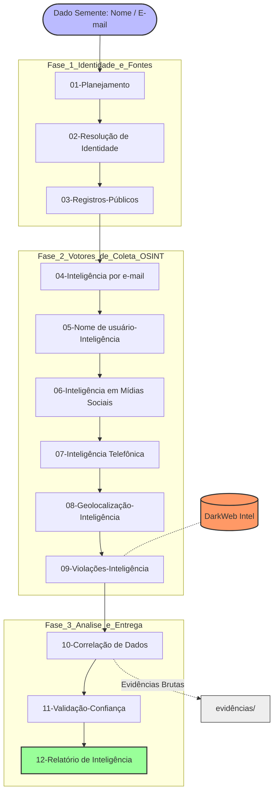

# 🔍 Estudo de Caso: Self-OSINT & Gestão de Superfície de Ataque
> **Arquitetura de Inteligência Forense: Metodologia Trace Labs, NIST SP 800-115 & MITRE ATT&CK**


## 📌 Visão Geral
Este repositório 3.0  documenta a execução de um ciclo completo de **Self-OSINT (Auto-Inteligência em Fontes Abertas)** e **Privacy Hardening**. O objetivo principal é auditar a pegada digital pessoal, identificar Informações Pessoalmente Identificáveis (PII) expostas e avaliar a superfície de ataque a partir de dados semente.

A estrutura foi totalmente refatorada em um pipeline modular de 12 etapas correlacionadas, priorizando a cadeia de custódia, a reprodutibilidade dos achados e a conformidade com frameworks globais de cibersegurança e perícia digital.

> **Aviso Legal & Ética:** Este laboratório é voltado exclusivamente para fins educacionais, auditoria pessoal (Self-OSINT) e construção de portfólio defensivo. Todos os dados sensíveis e relatórios finais são higienizados/mascarados.

---

## 🛡️ Alinhamento Metodológico e Frameworks

O ecossistema do repositório foi projetado para cobrir todas as fases de uma investigação de inteligência cibernética profissional:

* **Trace Labs Methodology:** Estruturação estrita de *Case Management*, segregação de evidências brutas e geração de inteligência acionável.
* **MITRE ATT&CK (Reconnaissance):** Mapeamento direto das táticas de coleta de identidade (**TA0043**), infraestrutura e vetores de entrada.
* **NIST SP 800-115:** Aplicação de diretrizes técnicas para revisão de segurança, análise de vulnerabilidade passiva e validação de exposição.
* **PTES (Penetration Testing Execution Standard):** Execução padronizada da fase 2 (*Intelligence Gathering / Passive Footprinting*).
* **NIST CSF:** Categoria *Identify (ID.RA)* para gestão de superfície de ataque.
---

## 🛠️ Pipeline de Investigação & Fluxo de Inteligência



##📂 Arquitetura do Repositório (Estrutura Modular de Pastas)

A organização dos diretórios reflete a progressão lógica da investigação. Cada pasta contém sua própria documentação em Markdown (.md) contextualizando os achados, ferramentas utilizadas e mitigações:

```
.
├── 📁 01-Planejamento/               # Escopo, regras de engajamento, matriz de riscos e Dorks
├── 📁 02-Resolução de Identidade/    # Descarte de homônimos, pivotes e perfil consolidado
├── 📁 03-Registros-Públicos/         # Consultas em Diários Oficiais, portais governamentais e Jusbrasil
├── 📁 04-Inteligência por e-mail/    # Enumeração de serviços (Holehe), repositórios e registros
├── 📁 05-Nome de usuário-Inteligência/# Mapeamento de handles (Sherlock/Maigret/WhatsMyName)
├── 📁 06-Inteligência em Mídias Sociais/# SOCMINT: Mapeamento de pegada em redes sociais
├── 📁 07-Inteligência Telefônica/    # Análise de numeração (PhoneInfoga/Libphone/Pix)
├── 📁 08-Geolocalização-Inteligência/# GEOINT: Metadados EXIF, análise visual e triangulação
├── 📁 09-Violações-Inteligência/     # Breach OSINT (Have I Been Pwned/DeHashed/LeakCheck)
├── 📁 10-Correlação de Dados/        # Mapeamento em grafos de relacionamento e cruzamento de vetores
├── 📁 11-Validação-Confiança/        # Matriz de confiabilidade das fontes e eliminação de ruído
├── 📁 12-Relatório de Inteligência/  # Dossiê final processado e plano de privacy hardening
├── 📁 DarkWeb/                       # Monitoramento de menções e PII expostas em fóruns não indexados
├── 📁 evidências/                    # Artefatos brutos, hashes SHA-256 e capturas de tela forenses
├── 📄 .História                      # Log incremental de histórico e alterações do ambiente
├── 📄 00_Guia_Forense..md            # Diretrizes metodológicas e procedimentos operacionais (SOP)
├── 📄 README.md                      # Documento mestre de apresentação do repositório
└── 📄 ferramentas.md                 # Curadoria da stack tecnológica e utilitários de OSINT
```

## 🧰 Stack Tecnológica e Ferramental (Toolchain)

| Categoria | Ferramenta | Padrão / Framework | Aplicação no Projeto |
| :--- | :--- | :--- | :--- |
| **Automação & Enriquecimento** | **SpiderFoot** | OSINT Automation | Mapeamento passivo de ativos, IPs, registros DNS e subdomínios. |
| **Enumeração de Usernames** | **Maigret / Sherlock** | MITRE T1593.001 | Varredura de nomes de usuário em +3.000 serviços web para análise de reuso. |
| **Inteligência de E-mail** | **Holehe** | MITRE T1589.002 | Validação silenciosa de cadastro de e-mail em endpoints de recuperação. |
| **Telecom & Mensageria** | **PhoneInfoga / Libphone** | NIST SP 800-115 | Parsing do padrão E.164, identificação de operadora e Dorking de terminal. |
| **Breach Intelligence** | **Have I Been Pwned** | Threat Intel | Consulta e correlação de credenciais vazadas em incidentes globais. |
| **Análise de Metadados** | **ExifTool** | GEOINT / Forense | Extração de marcas temporal, modelo de dispositivo e coordenadas GPS. |

---

## 🛡️ Táticas MITRE ATT&CK Mapeadas

| Tática | ID | Técnica / Sub-técnica | Aplicação no Repositório |
| :--- | :--- | :--- | :--- |
| **Reconnaissance** | **T1589.001** | *Gather Victim Identity: Credentials* | Mapeamento de usernames e vazamentos de senhas (`05` e `09`). |
| **Reconnaissance** | **T1589.002** | *Gather Victim Identity: Email Addresses* | Coleta e pivoteamento a partir de e-mails semente (`04`). |
| **Reconnaissance** | **T1593.001** | *Search Open Technical Databases* | Consulta em bases públicas de registros e vazamentos (`03` e `09`). |
| **Reconnaissance** | **T1594** | *Search Victim-Owned Websites* | Auditoria de perfis públicos, portfólios e redes sociais (`06`). |

---

## 💡 Próximos Passos & Roadmap

- [x] Estruturação da arquitetura de diretórios e documentação base.
- [ ] Execução da fase de coleta de vetores semente (`01` a `03`).
- [ ] Mapeamento e enumeração ativa dos vetores (`04` a `09`).
- [ ] Triangulação dos achados e confecção do relatório final de hardening (`10` a `12`).
