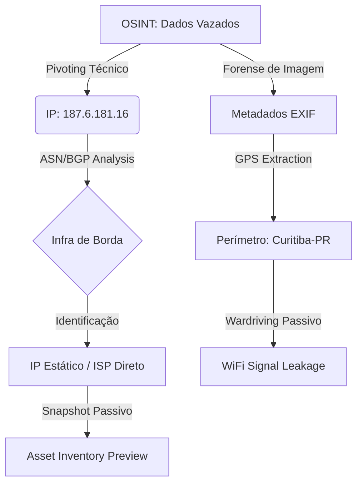

🛰️ Fase 02: Reconhecimento (Active & Network Recon)

**Data:** Janeiro 2026  
**Autor:** Zafire Daniel  

---

## 📖 Visão Geral
Esta etapa consolida a transição estratégica da inteligência passiva (**Fase 01 - OSINT**) para o reconhecimento direcionado. O objetivo foi validar dados históricos e transformá-los em inteligência operacional (GEOINT e NETINT), mapeando o perímetro físico, vetores de rádio-frequência (RF) e a infraestrutura de rede de borda.

---

## 🌉 Fluxo de Inteligência (Pivoting)
O diagrama abaixo ilustra o racional técnico utilizado para desmascarar o perímetro do alvo partindo de dados voláteis.

## 🏗️ Ponte de Inteligência: Do OSINT ao Ativo Técnico

| 📥 Output OSINT             | ⚙️ Processo de Recon      | 📤 Resultado Obtido                          |
| :-------------------------- | :------------------------ | :------------------------------------------- |
| **IP Histórico (2019)**     | BGPView / ASN Lookup      | Identificado IP Estático (Persistência Alta) |
| **Metadados de Mídia**      | Extração EXIF (T1590.001) | Geolocalização precisa do Laboratório        |
| **Coordenadas Geográficas** | Consulta Wigle.net        | SSID e Protocolo de Segurança (WPA2)         |
| **Identidade Digital**      | Shodan / Censys Snapshots | Previsão de Ativos (Nginx/Apache)            |

---

## 🛠️ Stack Tecnológica & MITRE Mapping

| Técnica MITRE | Ferramentas | Aplicação Prática |
| :--- | :--- | :--- |
| **T1590.001** (Gather Network Info) | ExifTool / Python Script | Localização física via Forense Digital |
| **T1593.002** (Search Open Websites) | Wigle.net | Identificação de Signal Leakage WiFi |
| **T1583.001** (Acquire Infrastructure) | BGPView / Whois | Análise de estabilidade e persistência de IP |
| **T1594** (Search Victim Hosts) | Shodan / Censys | Snapshot de serviços expostos (Sem Scan Direto) |

---

## 📂 Módulos Detalhados (Deep Dive)

A fase foi dividida em dois pilares fundamentais para garantir **OpSec** e precisão na transição técnica:

* 🌍 [**01_Recon_Physical.md**](./01_Recon_Physical.md): Focado em **GEOINT**, Radiofrequência (WiFi/BLE) e análise de perímetro físico.
* 🌐 [**02_Recon_Network.md**](./02_Recon_Network.md): Focado em **Inteligência de Rede**, análise de ASN/BGP e mapeamento passivo de ativos de borda.

---

## 📊 Principais Descobertas (Insight de Red Team)

> [!CAUTION]
> **Signal Leakage:** A rede wireless `[MASCARADO_LAB]` propaga sinal ~15m além do perímetro físico, permitindo ataques de proximidade e captura de handshakes em via pública.

> [!IMPORTANT]
> **Infra de Borda:** A ausência de camadas de WAF/Cloudflare e o uso de IP Estático tornam o alvo vulnerável a ataques de enumeração direta e garantem estabilidade para persistência de C2 (Command & Control).

---

## 🖼️ Evidências Visuais

  
*Legenda: Fluxo operacional de conversão de metadados em coordenadas de wardriving.*

---

## 🚀 Próximos Passos

Com o terreno mapeado e a infraestrutura física localizada, a operação avança para a interação técnica direta:

1.  **Fase 03: Enumeração Ativa** (Banner Grabbing e Scanning direcionado).
2.  **Auditoria Wireless:** Captura de handshake em áreas de *Signal Leakage* para quebra de criptografia.

---
[⬅️ Voltar para a Raiz do Projeto](../)