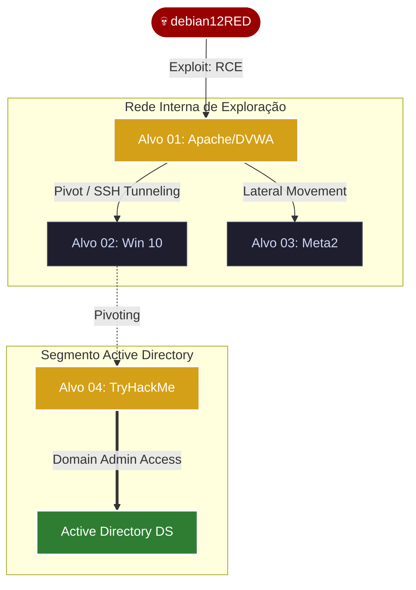

# 📂 Fase 03: Enumeration (Enumeração)

## 🎯 Objetivo da Fase
Nesta etapa, transformamos dados brutos em inteligência técnica acionável. O objetivo foi interagir ativamente com os serviços para identificar banners de versão, diretórios ocultos e configurações permissivas que servirão de vetores para as próximas fases de exploração.

---

## 🛡️ Nota sobre Discrição vs. Visibilidade (OPSEC)

> [!TIP]
> **Considerações de Evasão e Monitoramento:**
> Embora em cenários reais de Red Team sejam priorizadas técnicas de **Living off the Land (LotL)** e métodos de enumeração furtiva (stealth) para evitar detecção por EDRs e SIEMs, este laboratório optou deliberadamente pelo uso de ferramentas padrão da indústria como `nmap`, `gobuster` e `nikto`. 
>
> **Esta decisão estratégica visa:**
> 1. **Fomentar o Treinamento do Blue Team:** Gerar logs e telemetria suficientes para que as equipes de defesa possam validar suas regras de detecção e assinaturas de ataques conhecidos.
> 2. **Metodologia de Portfólio:** Documentar de forma clara e didática a identificação de vetores de ataque através de ferramentas consolidadas.
> 3. **Eficiência de Escopo:** Priorizar a cobertura total da superfície de ataque em ambiente controlado, simulando um teste de invasão (Pentest) focado em vulnerabilidades.

---

## 🏗️ Estratégia de Rede & Superfície de Ataque

| Alvo | Papel no Lab | Vetor Crítico Identificado | Complexidade |
| :--- | :--- | :--- | :--- |
| **Alvo 01 (Apache)** | Foothold (Ponto de Apoio) | Injeção de Comandos (RCE) | Média |
| **Alvo 02 (Win 10)** | Lateral Movement Target | SMB Vulnerável / WinRM | Alta |
| **Alvo 03 (Meta2)** | Pivot / Data Exfiltration | Serviços Legados & Backdoors | Baixa |
| **Alvo 04 (TryHackme)** | Pivoting / Entry Point AD | Credential Dumping / Kerberoasting | Crítica |

---

## 📚 Frameworks e Metodologias de Referência

* **[PTES](http://www.pentest-standard.org/):** Padronização do fluxo de trabalho e camadas do modelo OSI.
* **[MITRE ATT&CK® (TA0007)](https://attack.mitre.org/tactics/TA0007/):** Técnicas de Discovery e reconhecimento interno.
* **[NIST SP 800-115](https://csrc.nist.gov/publications/detail/sp/800-115/final):** Integridade técnica e procedimentos de testes.
* **[OWASP WSTG](https://owasp.org/www-project-web-security-testing-guide/):** Guia de teste de segurança para aplicações Web.

---

## 🛠️ Toolstack (Arsenal Utilizado)

* **Network Discovery:** `nmap` (Service Detection & NSE Scripts).
* **Web Enumeration:** `gobuster`, `nikto`, `dirb`.
* **Windows/AD Recon:** `enum4linux-ng`, `smbclient`.
* **Banner Grabbing:** `netcat` & `curl`.

---

## 🛠️ Custom Tooling

* **AutoEnum (Bash):** Orquestração de ferramentas para varredura em massa.
* **BannerHunter (Python):** Extração de assinaturas e análise de risco preliminar.

> "A automação nesta fase visa reduzir a margem de erro humano e garantir a padronização na coleta de evidências."

---

## 📄 Relatórios Detalhados nesta Pasta

1.  [**01-Enumeration-Apache.md**](./01-Enumeration-Apache.md): Foco em Web App e exploração de RCE.
2.  [**02-Enumeration-Win10.md**](./02-Enumeration-Win10.md): Foco em protocolos de rede interna (SMB/WinRM).
3.  [**03-Enumeration-Metasploitable2.md**](./03-Enumeration-Metasploitable2.md): Foco em infraestrutura legada e backdoors.
4.  [**04-Enumeration-THM-AD.md**](./04-Enumeration-THM-AD.md): Foco em Pivoting e reconhecimento de Active Directory.

---

👉 **[Ver Mitigações no Repo de Blue Team](https://github.com/seu-link-aqui)**
