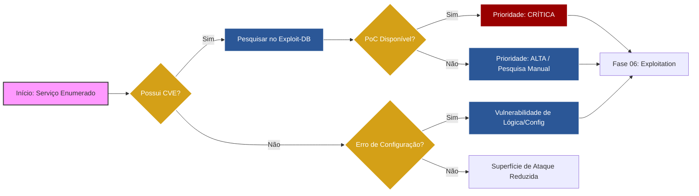

# 🔍 Fase 05: Vulnerability Research (Pesquisa de Vulnerabilidades)

## 🎯 Objetivo da Fase
Nesta etapa, cruzamos os artefatos técnicos coletados na **Fase 03 (Enumeration)** com bases de dados globais de vulnerabilidades (**CVE**, **CWE**, **NVD**). O foco não é apenas encontrar falhas, mas validar quais delas são **exploráveis** e possuem maior impacto no caminho crítico até o objetivo final (Domain Admin).

---
## 📉 Fluxo de Triagem de Vulnerabilidades

---

## 📋 Metodologia de Pesquisa
A análise de vulnerabilidades neste laboratório segue o framework de severidade **CVSS v3.1**, priorizando ativos com base em:
1.  **Exploit Code Maturity:** Disponibilidade de PoCs (Proof of Concept) públicos.
2.  **Attack Vector:** Vulnerabilidades que podem ser exploradas via rede (Network).
3.  **Privileges Required:** Foco em falhas que não exigem autenticação prévia (Pre-Auth).

---

## 🏗️ Matriz de Vulnerabilidades Identificadas (Working Draft)

Esta tabela é alimentada conforme os serviços enumerados são validados em bases de exploits.

| ID Alvo | Serviço / App | Vulnerabilidade Identificada | CVE / CWE | Impacto | Status |
| :--- | :--- | :--- | :--- | :--- | :--- |
| **Alvo 01** | Apache 2.4.x | Command Injection | CWE-77 | RCE (Foothold) | ✅ Validado |
| **Alvo 02** | Win10 (SMB) | Possível SMB Signing Disabled | CWE-307 | Relay / Spoofing | ⏳ Pesquisando |
| **Alvo 03** | vsftpd 2.3.4 | Backdoor Service | CVE-2011-2523 | Root Access | ✅ Validado |
| **Alvo 04** | Windows AD | Kerberoasting / AS-REP Roasting | T1558 | Escalada de Priv. | ⏳ Pesquisando |

---

## 🏗️ Matriz de Priorização 

| ID Alvo | Vetor de Ataque | Severidade (CVSS) | Vetor MITRE | Facilidade de Exploit |
| :--- | :--- | :--- | :--- | :--- |
| **Alvo 01** | Command Injection (Apache) | 9.8 (Crítica) | T1190 | Alta (Public PoC) |
| **Alvo 02** | SMB Relay / WinRM | 8.8 (Alta) | T1557 | Média (Necessita Interação) |
| **Alvo 03** | Backdoor vsftpd 2.3.4 | 10.0 (Crítica) | T1210 | Imediata (Metasploit) |

---

## 📄 Relatórios de Análise Técnica

Para cada vulnerabilidade crítica identificada, foi gerado um relatório detalhado de viabilidade técnica:
### 🛡️ [Análise 01: RCE via Command Injection (Alvo 01)](./Analysis-Alvo01-RCE.md)
* **Foco:** Validação da falha de sanitização no DVWA e bypass de filtros básicos.
* **Status:** ✅ **Confirmado para Exploração.**

### 🛡️ [Análise 02: Backdoor vsftpd CVE-2011-2523 (Alvo 03)](./Analysis-Alvo03-FTP.md)
* **Foco:** Estudo do gatilho `:)` e abertura da porta 6200/TCP.
* **Status:** ✅ **Confirmado para Exploração.**

### 🛡️ [Análise 03: Misconfiguration WinRM/SMB (Alvo 02)](./Analysis-Alvo02-Windows.md)
* **Foco:** Pesquisa sobre escalada de privilégios via protocolos administrativos.
* **Status:** ⏳ **Em Validação Técnica.**

---

## 🛠️ Arsenal de Pesquisa Utilizado
---
### 1. Pesquisa Local (Offline)
* **Searchsploit:** Utilizado para consulta local à base de dados do **Exploit-DB**. Esta ferramenta permite identificar exploits funcionais sem a necessidade de tráfego externo, o que é essencial para manter o sigilo da operação e agilizar a busca por vetores de ataque.
    * *Exemplo de Uso:* `searchsploit apache 2.4`
* **Nmap Scripts (NSE):** Emprego de scripts da categoria `vuln` para realizar uma validação rápida e automatizada de vulnerabilidades conhecidas, permitindo uma triagem imediata de alvos suscetíveis a ataques públicos.

### 2. Bases de Dados Online
* **[NIST NVD](https://nvd.nist.gov/):** Repositório oficial de CVEs do governo americano.
* **[Exploit-DB](https://www.exploit-db.com/):** Coleção de exploits funcionais e PoCs.
* **[GitHub Advisory](https://github.com/advisories):** Pesquisa de exploits "0-day" ou recentes em repositórios.

### 3. Análise de Risco
* **[CVSS Calculator](https://www.first.org/cvss/calculator/3.1):** Cálculo preciso da severidade para o relatório final.

---

## 🛡️ Estratégia de Priorização
Diferente de um scanner automático, nossa pesquisa foca no **Encadeamento de Vulnerabilidades (Exploit Chaining)**:
> "Não buscamos apenas uma falha isolada, mas sim como a vulnerabilidade do Alvo 01 (RCE) nos fornece a posição necessária para explorar a configuração do Alvo 02 via rede interna."

---

## 📄 Documentação de Pesquisa Detalhada
*(Os arquivos abaixo contêm a análise profunda de cada CVE e como reproduzir o exploit)*

1. [**Analysis-Alvo01-Command-Injection.md**](./Analysis-Alvo01-Command-Injection.md): Estudo do vetor de entrada (Foothold) via Apache/DVWA no Macbook 2008.
2. [**Analysis-Alvo02-SMB-Windows.md**](./Analysis-Alvo02-SMB-Windows.md): Pesquisa sobre vulnerabilidades de rede interna e protocolos administrativos no Windows 10.
3. [**Analysis-Alvo03-CVE-2011-2523.md**](./Analysis-Alvo03-CVE-2011-2523.md): Análise profunda do backdoor vsftpd no Metasploitable 2 para obtenção de privilégios de ROOT.
4. [**Analysis-Alvo04-AD-Exploitation.md**](./Analysis-Alvo04-AD-Exploitation.md): Pesquisa de vetores de ataque contra Active Directory (Pivoting via TryHackMe).
---
👉 **[Ir para a Fase 06: Exploitation (Exploração) ->](../06_Exploitation/)**
