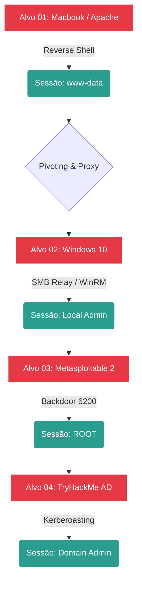

# 🧨 Fase 06: Exploitation (Execução de Ataque)

## 🎯 Objetivo da Fase
Esta fase consiste na execução prática dos vetores identificados na **Fase 05**. O objetivo é obter o **Foothold** inicial, estabelecer persistência e preparar o terreno para a exfiltração de dados ou movimentação lateral. 

> **Regra de Engajamento:** Todas as explorações são realizadas de forma controlada para garantir a integridade dos serviços e a coleta de evidências (screenshots/logs).

---

## 📉 Diagrama de Cadeia de Exploração (Kill Chain)

---

## 🔑 Tabela de Sessões e Controle de Acesso (Loot)

| Ordem | ID Alvo | Vetor de Ataque | Usuário Obtido | Estabilidade | Status |
| :--- | :--- | :--- | :--- | :--- | :--- |
| **01** | **Macbook (Apache)** | OS Command Injection | `www-data` | Média | ✅ Pwned |
| **02** | **Windows 10** | SMB Relay / WinRM | `Pending` | - | ⏳ Ativo |
| **03** | **Metasploitable 2** | vsftpd Backdoor | `root` | Alta | ✅ Pwned |
| **04** | **TryHackMe AD** | AD Exploitation | `Pending` | - | 🧊 Congelado |

---

## 🛠️ Arsenal de Exploração (Exploit Stack)

* **Handlers & Listeners:** `netcat (nc)`, `Metasploit Multi-Handler`, `pwncat-cs`.
* **Post-Exploitation & Pivoting:** `Chisel` (Tunneling), `Proxychains-ng`, `Socat`.
* **Windows/AD Tools:** `Impacket-Suite`, `Evil-WinRM`, `Responder`.
* **Linux Exploits:** Scripts Python customizados para o trigger do *vsftpd*.

---

## 📄 Relatórios de Exploração Técnica

* 🚩 [**Exploit-Alvo01-Macbook-RCE.md**](./Exploit-Alvo01-Macbook-RCE.md): Do comando injetado ao terminal interativo.
* 🚩 [**Exploit-Alvo02-Win10-Relay.md**](./Exploit-Alvo02-Win10-Relay.md): Movimentação lateral via rede interna.
* 🚩 [**Exploit-Alvo03-Meta2-Root.md**](./Exploit-Alvo03-Meta2-Root.md): Exploração do backdoor e controle total Linux.
* 🚩 [**Exploit-Alvo04-THM-AD.md**](./Exploit-Alvo04-THM-AD.md): Escala final para Domain Admin.

---

👉 **[Ir para a Fase 07: Post-Exploitation ->](../07_Post-Exploitation/)**

