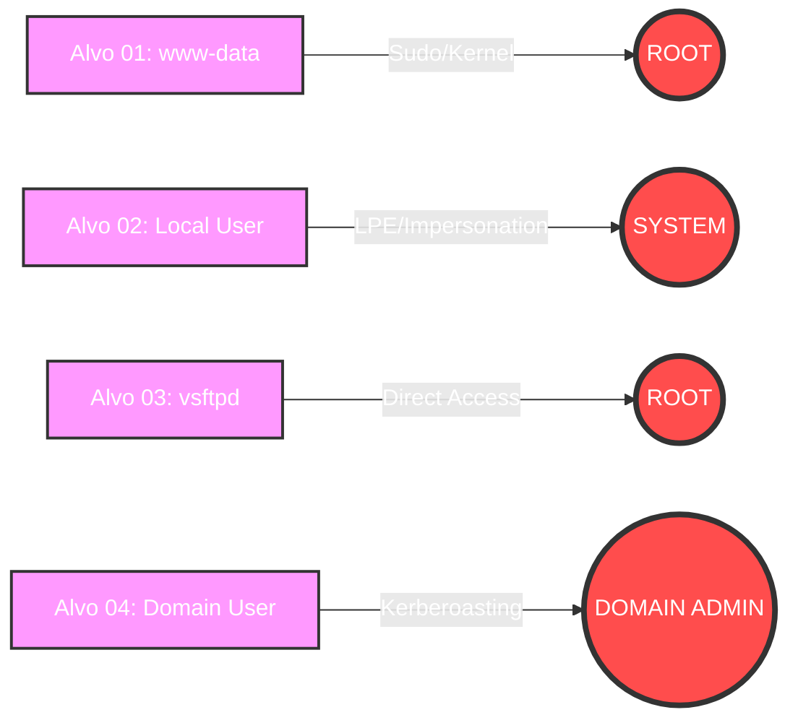

# ⚡ Fase 07: Privilege Escalation (Escalada de Privilégios)

## 🎯 Objetivo da Fase
Após obter o acesso inicial (**Foothold**) na Fase 06, o objetivo desta etapa é identificar e explorar falhas de configuração, vulnerabilidades de kernel ou permissões excessivas para elevar o nível de privilégio. O sucesso nesta fase garante controle total sobre os ativos e permite a extração de segredos profundos (hashes, senhas e chaves).

---

## 🛡️ Mapeamento MITRE ATT&CK
Esta fase foca nas seguintes táticas e técnicas:

| ID | Técnica | Descrição |
| :--- | :--- | :--- |
| **T1068** | Exploitation for Privilege Escalation | Uso de vulnerabilidades de Kernel (ex: DirtyPipe). |
| **T1548** | Abuse Elevation Control Mechanism | Abuso de binários SUID ou sudo sem senha. |
| **T1055** | Process Injection | Injeção em processos de maior privilégio (SYSTEM). |
| **T1003** | OS Credential Dumping | Extração de hashes do LSASS ou /etc/shadow. |

---

## 📈 Fluxo de Elevação (PrivEsc Path)

## 🛠️ Arsenal de Pós-Exploração (Post-Exploit Toolkit)

Para a identificação de vetores de escalada, foram utilizadas as seguintes ferramentas líderes de mercado:

* **Linux Enumeration:** `LinPEAS`, `Linux Exploit Suggester`, `Unix-privesc-check`.
* **Windows Enumeration:** `WinPEAS`, `PowerUp.ps1`, `SharpUp`.
* **Credential Dumping:** `Mimikatz`, `SecretsDump (Impacket)`, `Hashcat`.
* **AD Analysis:** `BloodHound`, `AdPEAS`.

---

## 📄 Relatórios de Escalada de Privilégios

Aqui estão detalhados os métodos, payloads e evidências utilizados para cada alvo específico:

1. 🔓 [**PrivEsc-Alvo01-Macbook.md**](./PrivEsc-Alvo01-Macbook.md): Abuso de binários **SUID/Sudo** e exploração de vulnerabilidades de **Kernel legado** (Debian 12 em hardware 2008).
2. 🔓 [**PrivEsc-Alvo02-Win10.md**](./PrivEsc-Alvo02-Win10.md): Exploração de **Tokens de Impersonação**, serviços com permissões fracas ou Kernel Exploits (LPE).
3. 🔓 [**PrivEsc-Alvo03-Meta2.md**](./PrivEsc-Alvo03-Meta2.md): *(Nota: Acesso ROOT já obtido via exploit direto na Fase 06. Este relatório foca em **Credential Dumping** e análise de segredos).*
4. 🔓 [**PrivEsc-Alvo04-AD-DomainAdmin.md**](./PrivEsc-Alvo04-AD-DomainAdmin.md): O caminho estratégico de movimentação lateral e escalada até o **Controlador de Domínio**.

---

## 🔑 Loot Room (Segredos Coletados)

> [!WARNING]  
> Por questões de conformidade e segurança, todos os hashes e senhas reais foram **ofuscados** ou substituídos por *placeholders* (ex: `hash_sha512_admin_2026...`).

| Host | Usuário | Tipo de Segredo | Status |
| :--- | :--- | :--- | :--- |
| **Alvo 01** | `root` | Hash SHA-512 (`/etc/shadow`) | ✅ Capturado |
| **Alvo 02** | `Administrator` | NTLM Hash (SAM/LSASS) | ⏳ Em Progresso |
| **Alvo 03** | `root` | Cleartext Passwords / SSH Keys | ✅ Capturado |

---

## 🛡️ Perspectiva de Defesa (Detection)
A escalada de privilégios é frequentemente detectada através de:
* Monitoramento de chamadas de sistema anômalas (Kernel Exploits).
* Logs de auditoria de comandos `sudo` ou alterações em grupos de segurança.
* Alertas de acesso a memória sensível (LSASS) no Windows.

---

👉 **[Ir para a Fase 08: Data Exfiltration ->](../08_Data_Exfiltration/)**