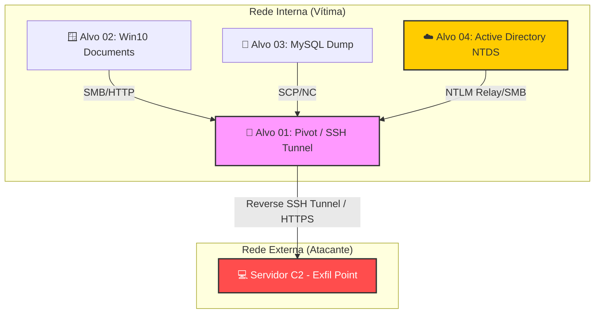

# 📤 Fase 08: Post-Exploitation & Data Exfiltration

## 🎯 Objetivo da Fase
Esta etapa consolida os resultados do engajamento. O foco aqui não é mais entrar, mas sim **extrair valor**. Documentamos a exfiltração de dados sensíveis (PII, segredos comerciais, credenciais) e a implementação de mecanismos de persistência que permitiriam o retorno ao ambiente mesmo após reinicializações ou correções parciais.

---

## 🛡️ Mapeamento MITRE ATT&CK (Exfiltration & Persistence)

| ID | Técnica | Descrição |
| :--- | :--- | :--- |
| **T1041** | Exfiltration Over C2 Channel | Retirada de dados através de túneis estabelecidos (HTTP/S). |
| **T1567** | Exfiltration Over Web Service | Uso de serviços legítimos (Pastebin, Google Drive) para evadir IDS. |
| **T1078** | Valid Accounts | Uso de credenciais legítimas capturadas para manter o acesso. |
| **T1543** | Create or Modify System Process | Criação de serviços para persistência no Windows/Linux. |

---

## 🏗️ Estratégia de Exfiltração

O diagrama abaixo ilustra como os dados foram coletados dos alvos internos e afunilados através do **Alvo 01 (Pivot)** para o servidor de comando e controle (C2) externo.

---

    
## 📄 Relatórios de Exfiltração e Persistência

Os detalhes de quais dados foram extraídos de cada alvo e como a persistência foi garantida:

1. 📂 [**Exfil-Alvo01-Macbook.md**](./Exfil-Alvo01-Macbook.md): Coleta de arquivos de configuração e persistência via SSH Key.
2. 📂 [**Exfil-Alvo02-Win10.md**](./Exfil-Alvo02-Win10.md): Exfiltração de documentos do usuário e persistência via Scheduled Tasks.
3. 📂 [**Exfil-Alvo03-Meta2.md**](./Exfil-Alvo03-Meta2.md): Dump de Banco de Dados MySQL e persistência via Web Shell oculta.
### ⚠️ Nota de Escopo: Domínio Active Directory (AD DS)

Devido à complexidade técnica e ao fato de o **AD DS (Active Directory Domain Services)** ser um "mundo à parte" dentro da cibersegurança, toda a documentação referente à exploração, movimentação lateral e exfiltração do **Alvo 04 (Domain Controller)** foi movida para um projeto/diretório dedicado. Esta decisão visa oferecer um detalhamento profundo e especializado sobre as técnicas de domínio (como _DCSync_, _Kerberoasting_ e o dump do _NTDS.dit_).

👉 **[Acesse aqui o Projeto Especial: Dominação de Active Directory](https://www.google.com/search?q=./AD_Domain_Domination/)**

---

## 💎 Evidence Vault (Os "Troféus")

| Tipo de Dado | Origem | Sensibilidade | Método de Saída |
| :--- | :--- | :--- | :--- |
| **Hashes de Domínio** | Alvo 04 | Alta (Crítica) | SMB Over Pivot |
| **Arquivos Financeiros** | Alvo 02 | Média (PII) | HTTPS POST |
| **Código Fonte** | Alvo 01 | Alta (IP) | SCP / SSH Tunnel |
| **Base de Clientes** | Alvo 03 | Alta (GDPR) | SQL Dump / ICMP |

---

## ⚠️ Notas de Limpeza (Anti-Forensics)
Durante esta fase, foram tomados cuidados para minimizar rastros, embora o objetivo do laboratório seja a detecção:
* Limpeza de logs de eventos seletivos (`wevtutil`).
* Remoção de executáveis de ferramentas (Mimikatz, WinPEAS) após o uso.
* Uso de nomes de processos legítimos para ocultar ferramentas de C2.

---
👉 **[Ir para a Fase 09: Report & Remediation ->](../09_Reporting/)**