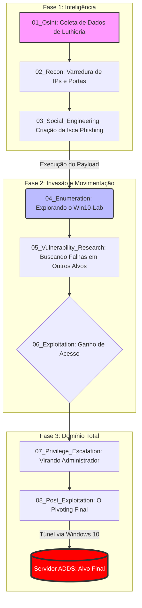

# 🏗️ Lab Infrastructure

## 📖 Visão Geral
Este documento detalha a infraestrutura técnica utilizada para a execução dos testes de intrusão e simulações de Red Team. O laboratório foi projetado para ser **híbrido**, combinando virtualização avançada para servidores e dispositivos físicos reais (Android) para simulação de ataques a endpoints móveis.

## 🖥️ 1. Inventário de Ativos (Asset Inventory)

### A. Host & Privacy Layer
* **Host Principal (Ubuntu Linux):** Base de gestão e orquestração de virtualização.
* **Whonix Gateway & Workstation (VM):** Camada de anonimato para investigações em **Dark Web** e coleta de inteligência via rede Tor.

### B. Attack & Target Nodes (Network 192.168.1.0/24)
| Ativo | S.O / Versão | Função Tática | IP / Status |
| :--- | :--- | :--- | :--- |
| **Debian 12 (Atacante)** | Linux (Debian 12) | Máquina de ataque principal (Metasploit/Nmap). | Gateway de Ataque |
| **Win10-Lab** | Windows 10 Home | Alvo inicial (Entry Point) e vetor para Pivoting. | DHCP |
| **Macbook 2008** | Debian 12 (Físico) | Servidor Vulnerável (Apache/DVWA/Samba/CrowdSec). | 192.168.1.X |
| **ADDS Server** | Windows Server | Controlador de Domínio (`Lab.local`) e Alvo Final. | 192.168.1.10 |
| **Metasploitable 2** | Linux (Legado) | Lab de exploração de serviços e protocolos obsoletos. | VM Interna |

### C. Mobile Lab (Physical Devices)
*   **Samsung J5 Prime (Android):** Testes de persistência e bypass de biometria/PIN.
*   **LG K8 (Android Legado):** Análise de vulnerabilidades em sistemas antigos via ADB.

---

## 🛠️ 2. Configurações de Rede e Isolamento
1.  **Bridged Interface (`enp4s0`):** Garante interconectividade entre VMs e dispositivos físicos, permitindo que o tráfego de auditoria seja isolado do Wi-Fi principal.
2.  **OpSec (Whonix):** Isolamento total de navegação externa para evitar vazamento de IP real durante fases de Recon.
3.  **Physical Lab Integration:** Integração de dispositivos mobile via Wi-Fi ou USB Passthrough para auditoria de comunicações sem fio.

---

## 🚀 4. Fluxo de Operação

📖 A História do Ataque (Passo a Passo)
Abaixo, explico o que cada pasta do meu laboratório faz, traduzindo o "Hackerês" para o mundo real:

🕵️ Fase 1: O Trabalho de Detetive
01_Osint (Investigação): É aqui que tudo começa. Como um detetive, usei a internet para descobrir os gostos da "vítima". Descobri que ela ama violões flamencos e a obra de Paco de Lucía. Essa informação é o nosso "bilhete de entrada".

02_Recon (Mapeamento): Agora que conheço a pessoa, preciso conhecer a casa (a rede). Usei ferramentas para ver quais portas estão abertas e quais computadores estão ligados, como o servidor principal e o Windows 10.

03_Social_Engineering (A Armadilha): Aqui criamos a isca. Usando o que descobri na fase 1, criei um documento falso sobre violões que parece inofensivo, mas que traz escondido o nosso "vírus" (payload). É o Cavalo de Troia moderno.

🛠️ Fase 2: Entrando na Casa
04_Enumeration (Exploração Interna): Já estamos dentro do primeiro computador (o Windows 10). Agora, olhamos em volta para ver o que tem nas gavetas digitais: pastas compartilhadas, impressoras e outros usuários.

05_Vulnerability-Research (Procurando Falhas): Analisamos os outros aparelhos da casa (como um Macbook antigo e servidores) para ver se eles têm "fechaduras velhas" ou sistemas desatualizados que facilitam a nossa entrada.

💥 Fase 3: O Domínio Total
06_Exploitation (A Invasão): É o momento de agir. Usamos as falhas que encontramos para assumir o controle dos outros aparelhos.

07_Privilege_Escalation (Virando o Dono): No começo, entramos como um usuário comum, que não pode fazer muita coisa. Nesta fase, usamos truques técnicos para "roubar a chave mestra" do sistema e virar o administrador total (Root/System).

08_Post_Exploitation (O Objetivo Final): Com as chaves na mão, fazemos o Pivoting. Usamos o Windows 10 como uma ponte para chegar ao cofre principal: o Servidor de Domínio (ADDS), onde ficam todas as senhas e segredos da empresa.

---

**Responsável Técnico:** Zafire Daniel  
**Última Atualização:** Janeiro de 2026
