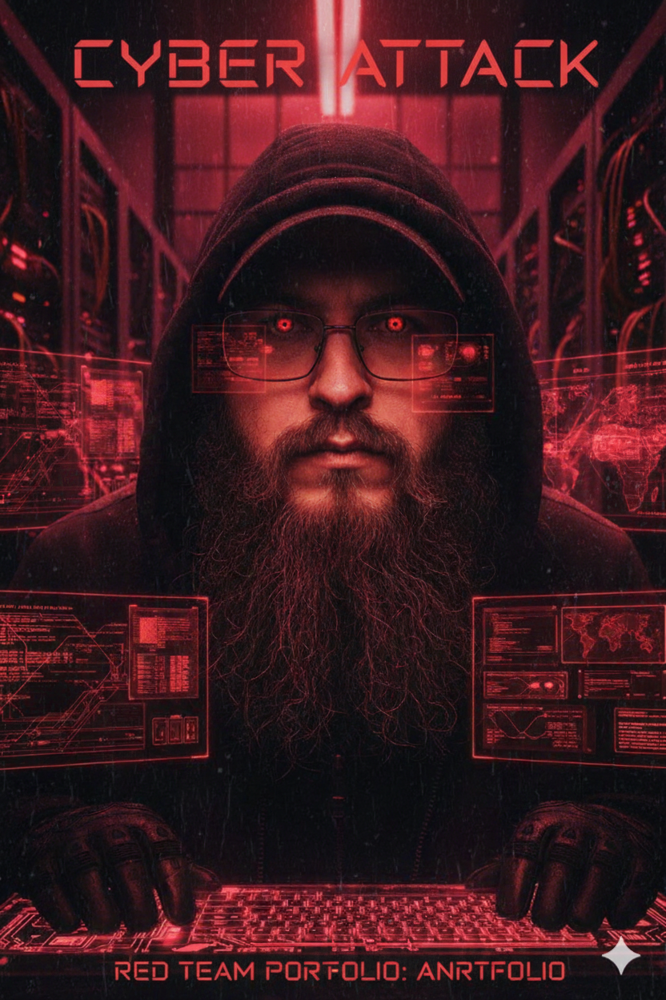

# Portfolio Pentest & Cibersegurança

**Bem-vindo ao meu portfólio profissional de Penetration Testing e Cibersegurança!**  

Este repositório documenta minhas habilidades técnicas em testes de invasão éticos, OSINT, reconnaissance, exploit development e boas práticas de segurança. Todo o conteúdo é educacional, utiliza alvos autorizados e segue princípios de responsible disclosure.

> **Aviso:** Nenhum ataque real foi realizado. Todos os exemplos são simulações ou demonstrações em ambientes controlados.

## 👨‍💻 Sobre Mim

Olá! Sou **Éden Zafire**, entusiasta de cibersegurança com foco em **Penetration Testing**, **Red Team** e **Threat Intelligence**.  

-🔍 Apaixonado por OSINT avançado, automação de ferramentas e ambientes hardened (Whonix, Kali, Parrot OS).  
-⚙️  Experiência em metodologias como PTES, MITRE ATT&CK e OWASP Testing Guide.  
-🎓 Sempre em busca de aprendizado contínuo: certificações em andamento (ex: OSCP, eJPT, Practical Ethical Hacking).  
-🎓 Comprometido com ética, privacidade e segurança responsável.

  

# 🛡️ Pentest – Estudos, Metodologias e Projetos

Este diretório reúne materiais, estudos e projetos relacionados a **pentest** (testes de intrusão) com o objetivo de aprofundar conhecimentos em segurança ofensiva.

Aqui são organizadas subpastas que abrangem diferentes áreas da segurança — como **OSINT**, **Enumeration**, **Vulnerability Research**, e outras áreas relacionadas à segurança ofensiva.

O objetivo é manter um repositório claro, estruturado e evolutivo que reflita o desenvolvimento contínuo dos estudos.

## Este projeto está estruturado na seguinte ordem

## 📁 01_OSINT — Open Source Intelligence
[🔎 **Acessar Diretório**](https://github.com/edenzafire/Portfolio_pentest/tree/main/01_Osint)

Nesta fase foi realizada a coleta de informações exclusivamente a partir de fontes abertas, sem interação direta com o alvo. 

Foram analisados dados publicamente acessíveis, tais como:
* Perfis em redes sociais.
* Presença digital.
* Informações indexadas em motores de busca.
* Conteúdos publicados voluntariamente.
* Vazamentos e exposições históricas.

**O objetivo do OSINT** é compreender o rastro digital deixado de forma pública, servindo como base para as fases subsequentes do laboratório.

---

## 📁 02_Recon — Reconhecimento
[🕵️‍♂️ **Acessar Diretório**](https://github.com/edenzafire/Portfolio_pentest/tree/main/02_Recon)

A fase de Reconhecimento teve como foco mapear a superfície de ataque, correlacionando as informações obtidas no OSINT com possíveis ativos e contextos técnicos. 

Nesta etapa foram conduzidas atividades de:
* Identificação de ativos.
* Análise de infraestrutura exposta.
* Fingerprinting de serviços.
* Correlação entre dados humanos e técnicos.

**O Recon** permite transformar dados brutos em contexto estruturado, orientando a enumeração de forma mais precisa.

---

## 📁 03_Enumeration — Enumeração
[🧩 **Acessar Diretório**](https://github.com/edenzafire/Portfolio_pentest/tree/main/03_Enumeration)

A enumeração aprofunda a análise dos ativos e informações identificadas anteriormente. 

Nesta fase foram observados:
* Serviços e recursos acessíveis.
* Usuários, padrões e comportamentos.
* Dados sensíveis expostos publicamente.
* Informações que ampliam a compreensão do alvo.

**O objetivo da enumeração** é reduzir incertezas e enriquecer o entendimento do ambiente, preparando o terreno para análises de risco mais aprofundadas.

---

## 📁 04_Social_Engineering — Análise de Engenharia Social (Conscientização)
[🧠 **Acessar Diretório**](https://github.com/edenzafire/Portfolio_pentest/tree/main/04_Social_Engineering)

Esta fase tem caráter exclusivamente analítico, educativo e defensivo. Com base nos dados coletados durante o OSINT, foi possível identificar como informações públicas, tais como preferências pessoais, gostos, hábitos expostos em redes sociais e padrões de comportamento, podem facilitar ataques de engenharia social quando exploradas por agentes maliciosos.

> ⚠️ **Importante:**
> Nenhuma engenharia social foi executada, simulada ou aplicada contra pessoas reais. Não são apresentados roteiros, diálogos, técnicas operacionais ou passo a passo de phishing.

**O objetivo desta fase** é demonstrar o risco associado à superexposição digital, promovendo conscientização sobre privacidade, segurança da informação e higiene digital.

---

## 📁 05_Vulnerability_Research — Pesquisa de Vulnerabilidades
[🟦 **Acessar Diretório**](https://github.com/edenzafire/Portfolio_pentest/tree/main/04_Vulnerability-Research)

Com base nos ativos, serviços e contextos identificados, foi realizada a pesquisa de vulnerabilidades conhecidas. 

As atividades incluem:
* Estudo de CVEs relevantes.
* Análise de falhas associadas a tecnologias identificadas.
* Avaliação de impacto potencial.
* Priorização teórica de riscos.

**Esta fase busca compreender o risco, não explorá‑lo diretamente.**

---

## 📁 06_Exploitation — Exploração (Ambiente Controlado)
[💥 **Acessar Diretório**](https://github.com/edenzafire/Portfolio_pentest/tree/main/05_Exploitation)

Nesta etapa foi realizada a validação prática de vulnerabilidades, exclusivamente em ambiente de laboratório controlado. 

Os objetivos incluem:
* Confirmar a viabilidade das falhas identificadas.
* Avaliar impacto técnico.
* Coletar evidências controladas.
* Simular acesso inicial de forma segura.

**Nenhuma atividade foi conduzida contra sistemas de terceiros ou ambientes de produção.**

---

## 📁 07_Privilege_Escalation — Escalada de Privilégios
[⬆️ **Acessar Diretório**](https://github.com/edenzafire/Portfolio_pentest/tree/main/06_Privilege-Escalation)

Após o acesso inicial em laboratório, foram analisadas possibilidades de elevação de privilégios. Esta fase envolve:
* Análise de permissões e configurações inseguras.
* Falhas de isolamento.
* Vetores comuns de escalada em sistemas Linux e Windows.

**O objetivo** é demonstrar como falhas de configuração podem amplificar o impacto de um comprometimento inicial.

---

## 📁 08_Post_Exploitation — Pós‑Exploração
[💀 **Acessar Diretório**](https://github.com/edenzafire/Portfolio_pentest/tree/main/07_Post-Exploitation)

A fase de pós‑exploração avalia o impacto completo do comprometimento, sempre em ambiente controlado. 

Nesta etapa são analisados:
* Possibilidades de persistência.
* Coleta de informações internas.
* Movimentação lateral simulada.
* Artefatos deixados após o ataque.

**Os resultados** subsidiam conclusões de risco, impacto e recomendações de mitigação, encerrando o ciclo técnico do laboratório.

---

## 📂 Outros Projetos e Recursos

* **[🌐 09 Web Application Testing](https://github.com/edenzafire/Portfolio_pentest/tree/main/08_Web_Application_Testing):** Testes de segurança em aplicações web (SQLi, XSS, CSRF, LFI/RFI).
* **[📡 10 Wireless](https://github.com/edenzafire/Portfolio_pentest/tree/main/09_Wireless):** Avaliação de segurança em redes sem fio e protocolos de criptografia.
* **[🏁 11 CTFs](https://github.com/edenzafire/Portfolio_pentest/tree/main/CTFs):** Resoluções documentadas de desafios Capture The Flag.
* **[🛠️ 12 Scripts](https://github.com/edenzafire/Portfolio_pentest/tree/main/Scripts):** Automações desenvolvidas para OSINT, Recon e Pentest.
* **[📄 13 Reports](https://github.com/edenzafire/Portfolio_pentest/tree/main/Reports):** Relatórios técnicos e executivos seguindo padrões de mercado.
* **[📝 14 Notes](https://github.com/edenzafire/Portfolio_pentest/tree/main/Notes):** Anotações técnicas e registros de aprendizado contínuo.
